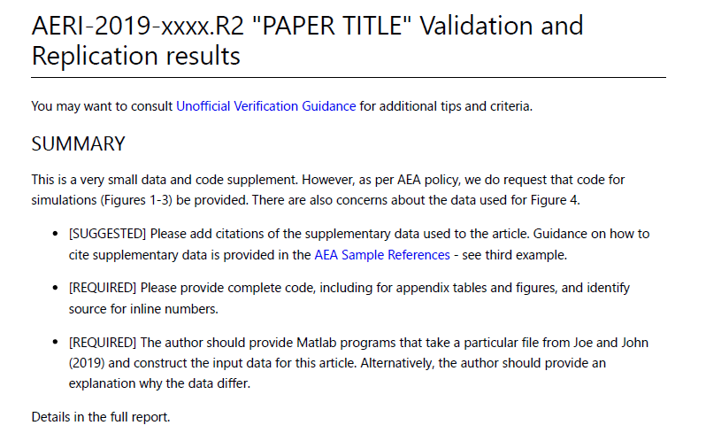
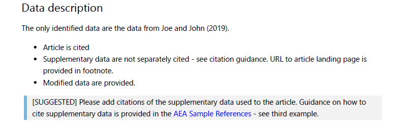
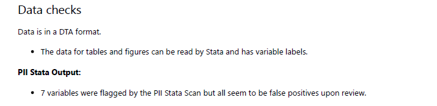

# A guided walk through the Replication Report

In order to work through a replication report, you will need

- [Access to computers](Access_to_computers.md)
- Reviewed the [Template REPORT](https://github.com/AEADataEditor/replication-template/blob/master/REPLICATION.md)

We have examples of various actual reports (slightly anonymized):

 + [Example 1](sample_report.md)
 + [Example 2](REPLICATION-AEAREP278.md)
 + [Example 3](REPLICATION-AEAREP282.md) and its [revision](REPLICATION-AEAREP282-revised.md)


## Some high-level concepts


### On data documentation

The [Social Science Data Editor's page on Data documentation](https://social-science-data-editors.github.io/guidance/Requested_information_data.html) provides guidance:

  + Identifying all data
  + What is great / good / just-good-enough data documentation
  + Citing data!

### On code documentation

The [Social Science Data Editor's page on Code and documentation](https://social-science-data-editors.github.io/guidance/Requested_information_code.html) provides guidance:

  + What do we consider to be "code"
  + Assessing the quality of the code documentation
  
### To come

How to modify code for replicability/verification


## What's in a replication report

The template used by the Lab can be found on Github at  [AEADataEditor/replication-template/blob/master/REPLICATION.md](https://github.com/AEADataEditor/replication-template/blob/master/REPLICATION.md). The table of contents looks like this:

- SUMMARY &ast;
- Data description &ast;
- Data checks &ast;
- Code description &ast;
- Stated Requirements &ast;
- Actual Requirements, if different
- Computing Environment of the Replicator
- Replication steps
- Findings
- Classification

We note that those sections marked "&ast;" can be completed before ever running any author-provided code, even when data are confidential. They lead to a preliminary report, which is a "dry" assessment of the completeness of the replication package. 

In most sections, when elements are missing, wrong, or do not work, we use a [standardized set of action items](https://github.com/AEADataEditor/replication-template/blob/master/sample-language-report.md) to highlight this. 

### Summary

The SUMMARY is intended for a quick glance by journal editor and authors. It should be short and succinct, with a bulleted (unduplicated) list of action items for the authors, drawn from the rest of the report. It is the first thing editors and authors will see. 



###  Data description

The data description can require substantial time to complete. The replicator is asked to identify all `input` (original) data sources used by the authors. It sometimes is useful to create a working list (spreadsheet) and commit the list together with the report. The ACRE project has a [useful template](https://bitss.github.io/ACRE/assessment.html#describe-inputs), but any list will suffice here. In addition, we ask replicators to  fill out the "Data Citation and Information report", to obtain a machine-readable list of data sources and their attributes. 

Once the preparations above are completed, a summary should be written in the "Data Description" section. 

#### Source data

For each data source, list 

- presence or absence of source data (data files), 
- presence or absence of codebook/information on the data, and summary statistics. Summary statistics and codebook may not be necessary if they are available for public use data. In all cases, if the author of the article points to an online location for such information, that is OK. 
- whether the *data* is cited (see the section on [data citations](#datacitations). Note that when authors cite data supplements, both the article and the data supplement should be cited - often, the latter is missing. 



#### Analysis data files

If any analysis data files are provided and found, they are listed. Analysis data files are produced by code in the deposit from data sources. Not every deposit will have these, and in some cases, there may be ambiguity if a data source is not clearly defined. In some cases, replicators will identify surplus data - data not associated with any source and any program. Authors are then asked to clarify this information.

### Metadata checks on deposit

Most replication packages received by the LDI Replication Lab will have been deposited in the AEA Data and Code Repository, but some may be on other trusted repositories (Dataverse, Zenodo, etc.).^[See the Social Science Data Editor website for a list of trusted repositories.] The replicators are asked to verify compliance with an AEA-specific list of required elements:


- [ ] JEL Classification (required)
- [ ] Manuscript Number (required)
- [ ] Subject Terms (highly recommended)
- [ ] Geographic coverage (highly recommended)
- [ ] Time period(s) (highly recommended)
- [ ] Collection date(s) (suggested)
- [ ] Universe (suggested)
- [ ] Data Type(s) (suggested)
- [ ] Data Source (suggested)
- [ ] Units of Observation (suggested)

If all required elements are provided, then the deposit passes. 
Many of the recommended elements are not applicable to all data deposits - for instance, a simulation has no "geographic coverage" or "collection date", but a survey clearly does. 


###  Data checks

When data are present, the replicator will run a few checks. These are not meant to be exhaustive, and are far less comprehensive than those suggested by trusted data curators. We ask for mostly simple checks, but which are known to fail. These are mostly checks that ensure some level of FAIR compliance.

- can data be read (using software indicated by author)? This is a plausibility check for corrupted data.
- Is data in archive-ready formats (CSV, TXT) or in custom formats (DTA, SAS7BDAT, Rdata)? Most trusted repositories will strongly suggest archive-ready formats, but there is a wide range of feasible formats. Our heuristic is that a format is "archive-ready" if it can be read by open-source software (not necessarily the original software). For instance, there are robust readers for Stata in R and Python, and so even though Stata formats are a proprietary format associated with commercial software, it is deemed acceptable. Exceptions we have found are files for Numbers (an Apple spreadsheet program that only works on MacOS) and Mathematica data files - neither have open-source readers. 
- Do the data files have variable labels and meaningful variable names? In other words, is it straightforward to understand what the data mean? Alternative, a codebook could be provided, that maps cryptic variable names (`Q25S3`) to meaningful labels. 

> Note that we do *not* require that variable *values* are provided here, nor that a full codebook is present or linked. Ideally, these would be here as well, and in some cases, we will go back to the authors and request them, *if* we think it is reasonable to do so  - a judgement call by the Data Editor.

- Replicators will run a simple check for personally identifiable information, if feasible, using a heuristic developed by J-PAL.^[The Stata version can be found [here](https://github.com/J-PAL/stata_PII_scan).] This check will have lots of false positives - fields it thinks might be sensitive that are not, in fact, sensitive. While replicators are asked to apply some judgement, the final decision must be made by authors, and the information is reported as such in the report.




###  Code description

https://github.com/AEADataEditor/replication-template/blob/master/code-check.xlsx

###  Stated Requirements
###  Actual Requirements, if different
###  Computing Environment of the Replicator
###  Replication steps
###  Findings
###  Classification


### Code description

> INSTRUCTIONS: Review the code (but do not run it yet). 

> INSTRUCTIONS: **Cleaning code:** Is there code that transforms the raw data files (listed above) into the (provided) analysis data?

> INSTRUCTIONS: **Analysis code:** Identify all **Figure, Table, and any in-text numbers**. Create a list, mapping each of them to a particular program and line number within the program (use [this template](code-check-TEMPLATE.xlsx)). Commit that list. You will come back to the list in your findings. IN THIS SECTION, point out only a summary description, including of shortcomings. E.g.

There are four provided Stata do files, three Matlab .m files, including a "master.do". 
- Table 5: could not identify code that produces Table 5
- Neither the program codes, nor the README, identify which tables are produced by what program.

> INSTRUCTIONS: You could generate list of all code files using the (Git) Bash shell:
> ```find . -name \*.do```
> will find all files ending in `.do `. That list can be provided.

```
programs/master.do
programs/table1.do
programs/table2.do
programs/figure1.do
programs/table3.do
programs/table4.m
programs/figure2.m
```

> NOTE: In-text numbers that reference numbers in tables do not need to be listed. Only in-text numbers that correspond to no table or figure need to be listed.

*What can go wrong?*

- Not all code is provided. Frequently missing:
  - Appendix code
  - Transforming *raw* data into *analysis* data
- Code does not identify where specific tables/figures/numbers are created
  - Ideally: one program per table/figure, called from master program
  - Also feasible: Labels within the programs
  - Issues: 
    - no labels
    - Mnemonic tables without numbering (`table_ols_fe.csv`)
    - No comments at all...


### Replication steps


> INSTRUCTIONS: provide details about your process of accessing the code and data.
> Do NOT detail things like "I save them on my Desktop".
> DO describe actions   that you did  as per instructions ("I added a config.do")
> DO describe any other actions you needed to do ("I had to make changes in multiple programs"), without going into detail (the commit log can provide that information)

Example:
1. Downloaded code from URL provided.
2. Downloaded data from URL indicated in the README. A sign-up was required (not indicated in README)
3. Added the config.do generating system information, but commented out log creation, as author already creates log files.
4. Ran code as per README, but the third step did not work.
5. Made changes to the way the third step is run to get it to work.

### Computing Environment

> INSTRUCTIONS: This might be automated, for now, please fill in manually. Remove examples that are not relevant, adjust examples to fit special circumstances. Some of this is available from the standard log output in Stata. These can be found by right-clicking on "My PC" (for a PC), "About this Mac" (for a Mac), and a combination of "free -g" and "cat /proc/cpuinfo" on Linux.

- Mac Laptop, 8 GB of memory
- CISER Shared Windows Server 2016, 256GB, Intel Xeon E5-4669 v3 @ 2.10Ghz (3 processors)
- CISER Virtual Windows Server 2016, 16GB, Intel Haswell 2.19 Ghz (2 processors)
- BioHPC Linux server, Centos 7.6, 64 cores; 1024GB RAM; 

> INSTRUCTIONS: Please also list the software you used (specific versions). List only the ones you used, add any not listed in the examples:

- Stata/MP 16
- Matlab R2019a
- Intel Compiler 3.14152

>> !!! NEW !!!

> INSTRUCTIONS: List the (approximate) time the code ran. This would be added here AFTER you've run the code!

Runtime: 30 min

or

Runtime: approx. 20 days

> > Up through this part, you have not needed to run the code !! - We call this the "Preliminary Report". So go ahead, and commit THIS document to the repository.

> > Now we actually run the code.


### Findings

> Describe your findings both positive and negative in some detail, for each **Figure, Table, and any in-text numbers**. You can re-use the Excel file created under *Code Description*. When errors happen, be as precise as possible. For differences in figures, provide both a screenshot of what the manuscript contains, as well as the figure produced by the code you ran.

#### Tables
- Table 1: Looks the same
- Table 2: (contains no data)
- Table 3: Minor differences in row 5, column 3: 
  - Reproduced: **0.003** 
  - Manuscript:  **0.3**

#### Figures
> INSTRUCTIONS: Please provide a comparison with the paper when describing that figures look different. Use a screenshot for the paper, and the graph generated by the programs for the comparison. Reference the graph generated by the programs as a local file within the repository.

Example:
- Figure 1: Looks the same
- Figure 2: no program provided
- Figure 3: Paper version looks different from the one generated by programs:

Paper version:


Figure 3 generated by programs:


#### In-Text Numbers
> INSTRUCTIONS: list page and line number of in-text numbers. If ambiguous, cite the surrounding text, i.e., "the rate fell to 52% of all jobs: verified".

[ ] There are no in-text numbers, or all in-text numbers stem from tables and figures.

[ ] There are in-text numbers, but they are not identified in the code

Example:
- Page 21, line 5: Same


### Classification

> INSTRUCTIONS: Make an assessment here.
>
> Full replication can include a small number of apparently insignificant changes in the numbers in the table. Full replication also applies when changes to the programs needed to be made, but were successfully implemented.
>
> Partial replication means that a significant number (>25%) of programs and/or numbers are different.
>
> Note that if any data is confidential and not available, then a partial replication applies. This should be noted on the "Replication assessment questionnaire"/ JIRA.
>
> Note that when all data is confidential, it is unlikely that this exercise should have been attempted.
>
> Failure to replicate: only a small number of programs ran successfully, or only a small number of numbers were successfully generated (<25%)

- [ ] full replication
- [ ] full replication with minor issues
- [ ] partial replication (see above)
- [ ] not able to replicate most or all of the results (reasons see above)


## Some additional materials

Here's a collection from older presentations:

 + [Elements of a replication report](Replication-Report-Overview.pdf)
 + [Replicator checklist](replicator_checklist.pdf)
