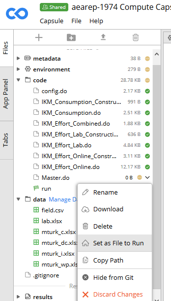

`# AEA: Reproducibility Checks in Codeocean

The workflow should be the same up until the verification stage, at which point you will use Codeocean to run the reproducibility check, as opposed to running directly in the statistical software. You can run Codeocean on your personal workspace or on CISER.

## Create a Capsule

- In Codeocean, create a new capsule. Name the compute capsule as "`AEAREP-xxxx Compute Capsule for: TITLE`"
Example:

> AEAREP-1974 Compute Capsule for: Waiting to Choose: The Role of Deliberation in Intertemporal Choice

## Environment

- Set up the environment specified by the authors. This includes software, version of that software, and any dependencies (packages). 
Example:
`Stata(16) with ssc packages estout and boottest`

    

## Files and Directories

- There are only three directories in the Codeocean environment: `/data`; `/code`; `/results`.
    - All paths in the code must refer to one of these directories.
    - If the authors set their own globals, you change the globals to reflect these directories.
    - If the authors do not use globals, you should make the code more reproducible by setting globals in the `config.do` and amending the paths in the authors' code. Example:
    `use "D:\Dropbox\Data for paper\x.dta"` becomes `use "$data/x.dta"` where `$data` is defined in `config.do`: `global data "/data"`.

- Upload the code  to the `/code` and the data files to the `/data` directories in Codeocean.

- Define the default `run` file using the dropdown menu to the right of the file. This will create a new file (called `run`) which is a Bash script that CodeOcean uses to run all of the other code. 

    

- Which file to use for the automatic creation of the `run` file depends on your manuscript:
    - If the manuscript has a single master file (e.g., `master.do`), use that. The `run` file will then look like 
    ```
    #!/usr/bin/env bash
    set -ex

    # This is the master script for the capsule. When you click "Reproducible Run", the code in this file will execute.
    stata-mp -q do master.do "$@"
    ``` 
    - If the authors provide instructions on a specific order in which to individually execute programs, each program will need to be added to the "run" file in that order. In this case, you should be including the `config.do` at the top of each program instead of only the `Master.do`. 
    ```
    #!/usr/bin/env bash
    set -ex

    # This is the master script for the capsule. When you click "Reproducible Run", the code in this file will execute.
    stata-mp -q do 01_step1.do "$@"
    stata-mp -q do 02_step2.do "$@"
    stata-mp -q do 03_step3.do "$@"
    stata-mp -q do 04_step4.do "$@"
    ``` 

## Log files

- As with any case, if the authors' code creates log files, you can comment out the log file creation in the `config.do`. 
- Any code that generates logfiles (this includes the `config.do`) needs to be amended to write to the `results` directory (i.e. `global logdir "/results"`). 
- Note that CodeOcean automatically generates a capture of all screen output in a file called "`output`" in the `results` directory. In many cases, this will be sufficient.

## Output

- Nothing is captured unless it is *explicitly* exported to the `/results` directory.
    - For example, you will not see any graphics files saved by the code unless they are saved as something such as `/results/figure1.gph`. 
    - You may not need to do this for intermediate data files. The program(s) should still run as long as the files are successfully created.
    - All tables and figures need to be adjusted to write to "`/results`". The best way is to use a global (yet again defined in the `config.do`), e.g. `graph export "$figures/figure1.pdf"`.

## Notes

- Note that some features will not work on CodeOcean if they rely on graphical windows (see LINK TO CODEOCEAN SITE)
  - A particular feature missing from Stata 16.0 on CodeOcean is the ability to write PNG graphics. Write PDF instead.

## Recording runs 

- Once you have finished editing and running the code in Codeocean, you should download the edited code and commit it to the repository. The best way to do this is similar to the steps taken during a revision (LINK TO INSTRUCTIONS FOR REVISION). Delete, by hand (**NOT** git rm), the code files as you downloaded them onto your workspace. Then, place the amended codes into that same directory. Git add, commit, push. We should then be able to identify the changes you made to the code in order to run it on Codeocean. See further guidance [here](https://github.com/labordynamicsinstitute/replicability-training/blob/master/Updating_Materials.md).

- Download the `/results` directory and add it to the repository.

## Jira

- The `Computing Environment` and `Working location of the data` should be "Codeocean"
- Share your CodeOcean capsule with `dataeditor@aeapubs.org`
- Add the CodeOcean shareable URL to the issue


