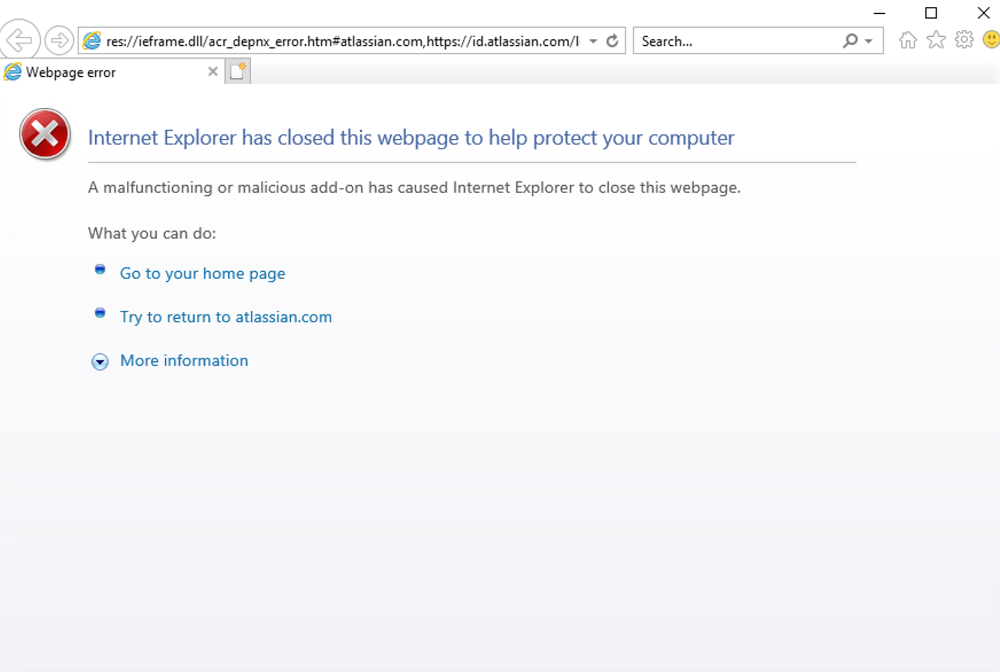

# Bitbucket Authentication

  

#### Temporary Solution

1. Make Firefox (or Edge) your default browswer. 
2. Sign into Bitbucket on your browswer and then attempt the git action once again. You may then receive an error like below:

  
3. Attempt the git action again.
