--- 
title: "TRAINING For Reproducibility Verification"
author: 
  - "Lars Vilhuber"
  - "Hyuk Son"
  - "Meredith Welch"
  - "David Wasser"
date: "2022-02-14"
site: bookdown::bookdown_site
output: bookdown::gitbook
documentclass: book
bibliography: [paper.bib, packages.bib]
biblio-style: apalike
link-citations: yes
github-repo:  labordynamicsinstitute/replicability-training-curriculum
description: "We provide training for students who will verify the reproducibility of economics articles."
---

# Introduction

This document is meant to guide the training of students in assessing the reproducibility of articles in the social sciences, and in particular in economics.


Content is [](https://creativecommons.org/licenses/by-nc/4.0/).

## How to read this document

If you are a casual reader of this document, start with the [pre-requisites](#pre-requisites). If you are a student participating in our training, then start with the [pre-training tasks](#pre-training). Read the rest sequentially.


  

<!--chapter:end:index.Rmd-->

# (PART) Overview {-}

# Background

On July 16, 2019, the AEA announced an updated "[Data and Code Availability Policy](https://www.aeaweb.org/journals/policies/data-code)" [@AEA-announcement-July-2019;@10.1257/pandp.110.dcap]. Henceforth, 
replication materials were to be made available to the AEA *prior* to acceptance - previously, it was prior to publication, but *after* acceptance. 
Computer code should be provided for all stages of the data cleaning and data analysis (code for the data cleaning portion was previously optional). 
Raw data must be uniformly made available, when permissions allow (also for author-collected survey data,   data from experiments). For restricted-access or proprietary data, to the extent permissible, the data must be made available to the AEA Data Editor for verification, even if the data cannot be published by the author.^[We regularly and successfully do so.]
Enforcement of an existing but unenforced **data citation requirement** as per [AEA Citation Guidelines](https://www.aeaweb.org/journals/policies/sample-references).

We also test licenses, access restrictions, and sometimes question the ability of authors to publish the data. We have had cases both ways: data provided after initial refusal, and data rejected by us because the license did not allow distribution.

For now, we also check for obvious personally identifiable information (PII). However,  the ultimate responsibility lies with authors.

All data and code must be available in a "trusted repository," which in most cases means the AEA's Data and Code Repository at openICPSR, for better transparency and findability. 		 ZIP files are no longer  accepted as supplementary packages, and we check that. 		Supplements are  tagged with JEL codes, other keywords (e.g., "`Current Population Survey`" or "`behavioral study`"), and optionally with methodological information (time period,  geographic region, survey method used). 		Each deposit gets its own DOI - a permanent unique identifier. Deposits can be found  through various search engines, such as the native search engine on openICPSR, through [Google Data Search](https://toolbox.google.com/datasetsearch) or through DOI registries such as [DataCite](https://search.datacite.org/).
		
To implement all this, we built a system using Jira, and connect to it from ScholarOne (system used for manuscript submission) and  openICPSR. 

## Activities of the LDI Replication Lab

The LDI Replication Lab conducts reproducibility checks in two way.


### Pre-Publication Evaluation of Reproducibility and Quality of Supplemental Materials

The Lab performs pre-publication evaluation for the American Economic Association, i.e., prior to publication. Think of it as a "reviewer" of the data supplement.

- Analyze the provided materials - see [Verification guidance](https://social-science-data-editors.github.io/guidance/Verification_guidance.html)
- Verify data citations
- Verify ability to post data (do the authors have the right to post the data?)
- If possible, attempt replication

### Post-Publication Evaluation of Reproducibility 

We download articles and supplements, assess to what extent an undergraduate student can run the code that produces the analysis reported in the paper.
We have also in the past done an evaluation of the response of authors when the code is only available "upon request". Not currently an active project.

This is a secondary goal, as time permits or as research goals suggest. It is quite similar to the first goal, but there is no interaction with authors, and no method to improve authors' files.

> Interested parties might visit [ACRE](https://bitss.github.io/ACRE/) for how to incorporate this kind of activity into a class curriculum.

## Learning goals

In this training, you will learn how to verify compliance with the policy. This means going through a variety of checklists, obtaining data, and running code, as per instructions provided by authors. You will not be required to actively program, but you will learn a lot about how to program (and sometimes, how not to program). You will gain an appreciation for a well-structured empirical analysis, which you will benefit from for your own studies (now) and in your work (after graduation).

<!--chapter:end:01-introduction.Rmd-->

# (PART) Preliminary Tasks {-}

# Pre-requisites 

Most students with some **prior experience with statistical software** can effectively reproduce and assess articles. In economics, most articles use either Stata or Matlab. 


Students should be comfortable working on a variety of computers, including their own, and be flexible with respect to the location of computing. If you don't know what that means, you'll find out during training!

<!--chapter:end:02-01-pre-requisites.Rmd-->

# Pre-training tasks {#pre-training}

We ask that trainees accomplish a few tasks prior to the first training session. Please do the following:

## Read

- The training is virtual, using video, and we frequently meet virtually. Review our [Video Etiquette rules](https://github.com/labordynamicsinstitute/replicability-training/wiki/Videoconferencing-Rules-and-Etiquette) (they are useful beyond our group as well)
- Review our [Privacy Policy](#privacy), where you will recognize how we handle your privacy, and the privacy of authors. 

## View

- View [my talk on the background of the lab](https://www.youtube.com/watch?v=pj-y3dLDOEA)), including what we do, and why we do it. 

<a href="https://www.youtube.com/watch?v=pj-y3dLDOEA"></a>


## Install


- Go through our [Setup Checklist](#checklist) and install necessary software

### Try-out

- Try out command line, Markdown, Git (we'll come back to it on the first day).

<!--chapter:end:02-02-pre-training-tasks.Rmd-->

# Toolkit

In this chapter, we will introduce you to a few of the toolkits that we will use for this project, and that you may find useful for most future data and code work.

## Command line

The shell (command line) is a power tool that allows you to do complex things with just a few keystrokes. You can combine and chain things together. Later in your studies, you may find that it is a fundamental tool used in combination, or even core, to other powerful tools and computing resources (including “high-performance computing” supercomputers). 

For our purpose, there are a few key features that are important:

- it is present on all the computers you will be working on (with the possible exception of the Bash shell on Windows, which we will get to shortly).
- it allows us to show you how things work without paying attention whether you are on a Mac, Linux, or Windows, or if you prefer one or the other fancy windowed program.

We will leverage the excellent lessons provided by the Software Carpentries, somewhat optimized for our purposes. 

> - Go to our [customized shell lesson](https://labordynamicsinstitute.github.io/shell-novice/)
> - See the [full lesson at Carpentries](https://swcarpentry.github.io/shell-novice/)

Note: we will walk you through the basics very quickly, but you will want to try this out later, on your own time, before we get to the Git lesson later.


## Markdown

(based on [this Carpentries tutorial](https://carpentries-incubator.github.io/jekyll-pages-novice/))

Markdown is a lightweight markup language, i.e. **a convention for adding
style information to textual content**.

Having a rather minimalistic syntax, text formatted in Markdown is comparably
readable.
This might be one reason for Markdown having become the language of choice
for formatted user input on websites like, for example:
- [Stack Exchange](https://stackexchange.com/)
- [GitHub](https://github.com/)
- [GitLab](https://about.gitlab.com/).


### Where to Start Writing Markdown?

A lot of tools for rendering Markdown source code exist.
Rendering is the process of generating a nice view of the content
using the style information included in the source text.
Chances are high, your editor can do this. Chances are, many websites use and render it. It is the native way to add formatting on Github, Bitbucket, etc.

In our case, we will use Visual Studio Code to write and preview Markdown. All of our reports will be written in Markdown. This tutorial is written in Markdown!

> - Open up Visual Studio Code, 
> - Add the line `# My Title` 
> - and save as a new file called 'README.md'

Let's add `Some **bold** font` and see what happens when we preview it using the preview button.

> Where is the Preview button? Read the introduction to the [Visual Studio Code: Writing Markdown](https://code.visualstudio.com/docs/languages/markdown) article to find out!

If new sections were added you will also find green vertical bars visually highlighting the new content.


### Writing Markdown

Now that we know about the editing interface and preview tab of our projects `README.md`
we can use it as a text editor and investigate selected Markdown features.

Our `README.md` already contains vanilla text and
two formatting features:
- Heading `# My Title`
- Emphasis using `**bold**`.

Let's learn some more Markdown by adding some formatting and see what happens when we preview it in the preview tab.
Add the following to your `README.md` file.

~~~
# My Title

Repo for learning how to write Markdown

## Learning Markdown

Vanilla text may contain *italics* and **bold words**.

This paragraph is separated from the previous one by a blank line.
Line breaks  
are caused by two trailing spaces at the end of a line.

[Carpentries Webpage](https://carpentries.org/)


### Carpentries Lesson Programs:
- Software Carpentry
- Data Carpentry
- Library Carpentry
~~~

You can see in the preview tab again to see how the formatting renders.


> ### Markdown trailing spaces are meaningful
>
> In the example above there are two spaces at the end of `Line breaks  `.
> These introduce what is called a **hard line break**, causing that paragraph to
> continue in the next line by adding a `<br/>` to the generated HTML.  
>
> If you break the line in a markdown file but don't include the two trailing spaces
> the generated HTML will continue in the same line **without** introducing a `<br/>`.
> This is called a **soft line break**.
>
> In some cases you may find that **soft line breaks** do introduce a `<br/>`.
> This can happen when using different [markdown flavors](#markdown-flavours).
>
> See for instance:
> ~~~
> Soft line
> break
>
> Hard line  
> break
> ~~~


> ### Exercise: Try Out Markdown
> [Online Markdown Tutorial](https://www.markdowntutorial.com/)


### Four reasons you should learn Markdown:

1. Less formatting than HTML
2. Easy to read even with formatting
3. Commonly used for websites and software development
4. We use it in our reports!

## Git

Git is a version control system, which we use extensively in the LDI Replication Lab.

### Why a version control system?

You can review  history of code or text to find out:

- _Which changes were made?_ Identify the lines that have been changed.
- _Who made the changes?_ If multiple people work on a project, who made the particular change. Also tabulate contributions to the project by person.
- _When were the changes made?_
- _Why were changes needed?_ The ability to attach _log messages_ provides a lot of information.

### Key Git Concept:  repository

A _repository = Git project_ is a  collection of files and folders, along with each file's revision history. There are

- _commits_: collections of additions or modifications, a snapshot
- _branches_: versions or variants of the main repository
- _clones_: Each copy of the repository is complete - fully functional
- _staging area_: an area on your computer where files and changes are collected prior to finalizing a _commit_

### Key Git Concept:  Github or Bitbucket?

There are multiple services that host repositories, and that can serve as a central reference point for these repositories.

- You _push_ to another repository - that could be on your buddy's computer, to a central entity (Github, Bitbucket) - however it is defined.
- You _pull_ changes from another repository.
- A _pull_ + _push_ is sometimes referred to as a _sync_ (synchronisation)

### Basic Git Commands

(also see the [Cheatsheet for Git](https://www.atlassian.com/git/tutorials/atlassian-git-cheatsheet))

- `git clone` creates a local copy of a project that already exists remotely. The clone includes all the project's files, history, and branches.

- `git add` stages a change. Git tracks changes to a working copy, but it's necessary to stage and take a snapshot of the changes to include them in the project’s history. This command performs _staging_, the first part of that two-step process. Any changes that are staged will become a part of the next snapshot and a part of the project's history.

- `git commit` saves the snapshot to the project history and completes the change-tracking process. In short, a commit functions like taking a photo. Anything that's been staged with `git add` will become a part of the snapshot with `git commit`.

+ `git status` shows the status of changes as untracked, modified, or staged.

- ` git pull` updates the local line of development with updates from its remote counterpart. You use this command if a teammate has made commits to a branch on a remote, and they would like to reflect those changes in their local environment. Or you made a commit on your laptop, and now want to continue the work on a remote desktop server.

- `git push` updates the remote repository with any commits made locally to a branch. Think of it as publishing your changes.

### A Tutorial

We will again leverage the excellent lessons provided by the Software Carpentries, somewhat optimized for our purposes. 

> - Go to our [customized Git lesson](https://labordynamicsinstitute.github.io/git-novice/)
> - See the [full lesson at Carpentries](https://swcarpentry.github.io/git-novice/)


### Some additional resources

- [General resources](https://try.github.io/)
- [Git tutorial](https://guides.github.com/introduction/git-handbook/)


<!--chapter:end:02-03-toolkit.Rmd-->

# (PART) Basics {-}

# Basic Concepts

The goal of the reproducibility activity is 

- to verify provenance of all data sources, 
- to verify the availability of all computer code to produce analysis files from data sources, and to produce tables, figures, and in-text numbers from analysis files,
- to verify that the available code actually reproduces the analysis files, tables, figures, and in-text numbers.

We therefore need to define a few concepts:

- what is a data source, and how can one verify its provenance?
- what is analysis data?
- how can we verify computational reproducibility?

The subsequent chapters will explore each of these in additional detail.

<!--chapter:end:04-concepts.Rmd-->

# Data citations and data availability statements {#datacitations}

Most students and researchers have been trained to cite their sources. Mostly, this is meant to be literature sources, but the basic idea applies just as much to data: If you use somebody else's data, you should acknowledge that. 

## A very short history of data citations

The almost complete absence of data citations from the literature has lead to issues when data creators and data providers attempt to assess their impact on science. Typically, they revert to manually or algorithmically scouring the literature, trying to find instances where their data is used.


In 2016, a number of scientists and publishers from many domains got together and issued the FAIR Data principles [@FORCE11FAIRDATAPRINCIPLES]. "FAIR" is an acronym for

- Findable, 
- Accessible, 
- Interoperable, and 
- Re-usable

These are principles which help the furthering of increased reproducibility - by making data accessible, reproducibility checks can be conducted. By making them interoperable and re-usable, others can reproduce, replicate, and expand on the original research. Findability remains an issue: how do you discover data that is hidden in a ZIP file on a journal website as part of an (otherwise) perfectly reproducible package? 

In fact, the same group had previously laid the groundwork to that. In 2014, they issued the "[Data Citation Principles](https://doi.org/10.25490/a97f-egyk)  (DCP)" [@force11declaration]. These laid out the ethical need for such citations, the content such citations should have, and some desirable attributes of data citations. Both the DCP as well as  FAIR  suggest that data be assigned unique identifiers, allowing them to be clearly referenced, and found. The most common identifier in the social sciences is the Digital Object Identifier (DOI), but others exist, in particular in the biological or physical sciences.

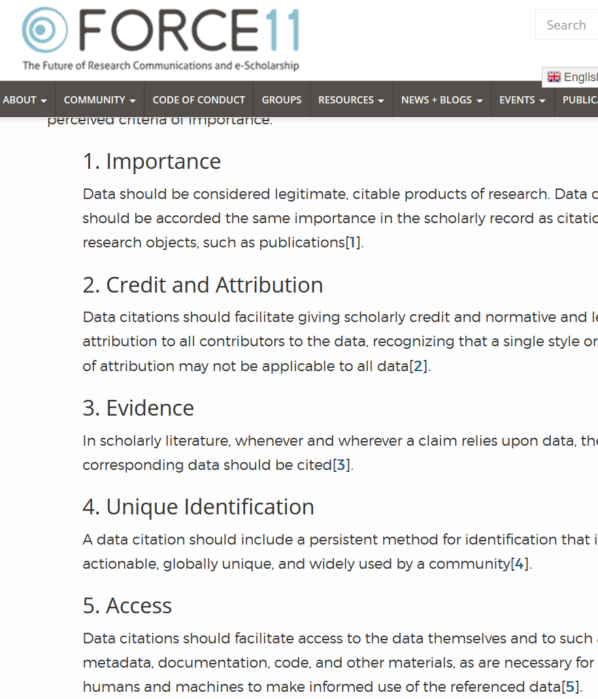

The DCC note that (emphasis added):

> Sound, reproducible scholarship rests upon a foundation of robust, accessible data. For this to be so in practice as well as theory, data must be accorded due importance in the practice of scholarship and in the enduring scholarly record. In other words, data should be considered legitimate, **citable products of research**. Data citation, **like the citation of other evidence and sources**, is good research practice and is part of the scholarly ecosystem supporting data reuse.

Data citation increases the findability, accessibility, interoperability, and re-usability of research data ([FAIR](https://www.go-fair.org/fair-principles/)).  Through data citations, data providers can link to articles ([sometimes automatically](https://www.crossref.org/services/event-data/)), allowing them to show the academic value of the data and continue providing the services around data creation. Finally, data citations open a new path to finding relevant science, by reaching the linked articles through data search interfaces, like [openICPSR](https://www.openicpsr.org/openicpsr/search/aea/studies), [Data-Pass](http://www.data-pass.org/), and [Google Dataset Search](https://toolbox.google.com/datasetsearch).

These principles are imperfectly implemented even today. Many data providers, including some of the biggest statistical agencies, do not provide unique identifiers to a particular data file. Some might uniquely identify a data series. Others may heuristically refer to certain versions ("V2"). Few have robust archival quality unique identifiers. 

Journals' stylistic considerations also reduce the impact of the DCC. Citations - in the sense of appearing in a bibliography at the end of the document - do not provide much sense of any access method other than a download. The AEA follows the Chicago Manual of Style (CMOS), with several [additions on the AEA website](https://www.aeaweb.org/journals/policies/sample-references).

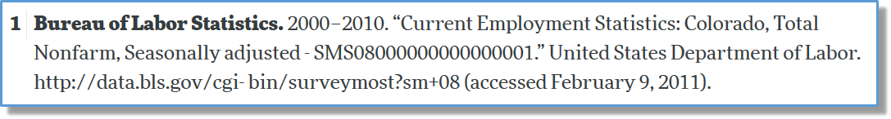

 As the [CMOS states](https://www.chicagomanualofstyle.org/book/ed17/part3/ch14/psec014.html), one of the criteria for a useful citation is conveying authority and permanence:

> Electronic content presented without formal ties to a publisher or sponsoring body has the authority equivalent to that of unpublished or self-published material in other media.

FAIR data helps convey such information, but often, assessing what "publisher" or "sponsoring body" is reputable or reliable is tricky. And the citation fails to convey many important facets of data access. What if the cited resource requires a login, even if it is free? What if payment is required? What if a long-winding application process is required? Citations do not communicate that amount of detail.  As we shall see [later](#dasmaster), there are ways to augment data citations with the needed information.

## How do you create a data citation

[ICPSR](https://www.icpsr.umich.edu/web/pages/datamanagement/citations.html) [@icpsr_citing_nodate] notes that a citation should include the following items:

- Author
- Title
- Distributor
- Date
- Version
- Persistent identifier

where any data source has the first five elements, and the ideal FAIR curated data source also has a persistent identifier. 

### An imperfect real example 

Consider the BLS citation shown earlier:

> Bureau of Labor Statistics. 2000–2010. “Current Employment Statistics: Colorado, Total Nonfarm, Seasonally adjusted - SMS08000000000000001.” United States Department of Labor. http://data.bls.gov/cgi-bin/surveymost?sm+08 (accessed February 9, 2011).

The *author* or creator is clearly `Bureau of Labor Statistics`. The *distributor* here is `United States Department of Labor`, which happens to be the government department housing the BLS. *Title* is arguably `Current Employment Statistics: Colorado, Total Nonfarm, Seasonally adjusted`, though some might argue that state, coverage, and seasonal adjustment identify *versions* of the survey. *Date* are the (original) dates of publication, or here, approximated by the date range covered by the series. But generally, *versions* relates to a chronologically released version - which is less clear in this case, and only captured by `(accessed February 9, 2011)`. There is no clear *persistent identifier*, the closest approximation is provided by a combination of the series identifier `SMS08000000000000001`, the URL `http://data.bls.gov/cgi-bin/surveymost?sm+08`, and the date accessed `(accessed February 9, 2011)`. Note that this is imperfect, because, unless you can time-travel, you cannot obtain the same dataset a second time. 

| Attribute | Value |
|:----------|-------|
| *Author*: | `Bureau of Labor Statistics`|
| *Title*: | `Current Employment Statistics: Colorado, Total Nonfarm, Seasonally adjusted`|
| *Distributor*: | `United States Department of Labor`|
| *Date*: | 2000-2010 |
| *Version*: | `(accessed February 9, 2011)`|
| *Persistent identifier*:| `SMS08000000000000001` +  `http://data.bls.gov/cgi-bin/surveymost?sm+08` + `(accessed February 9, 2011)`|

### An ideal (?) data citation

What should the ideal data citation look like? ICPSR suggests

> Barnes, Samuel H. Italian Mass Election Survey, 1968. Ann Arbor, MI: Inter-university Consortium for Political and Social Research [distributor], 1992-02-16. https://doi.org/10.3886/ICPSR07953.v1

so that

| Attribute | Value |
|:----------|-------|
| *Author*: | `Barnes, Samuel H.`|
| *Title*: | `Italian Mass Election Survey, 1968`|
| *Distributor*: | `Inter-university Consortium for Political and Social Research `|
| *Date*: | `1992-02-16`|
| *Version*: | `V1`|
| *Persistent identifier*:| `10.3886/ICPSR07953.v1`|

Note that the date `1968` describes the survey, but its date of publication was 1992. The version is implicit in the DOI. The persistent identifier is just `10.3886/ICPSR07953.v1`, but the display guidelines for DOI suggest including the full URL that yields a resolution.

### Data citation template

In general, therefore, as long as you can fill out the table

| Attribute | Value |
|:----------|-------|
| *Author*: | |
| *Title*: | |
| *Distributor*: | |
| *Date*: | |
| *Version*: | |
| *Persistent identifier*:| |

you can create a data citation:

> [AUTHOR], "[TITLE]", [DISTRIBUTOR], [DATE], [VERSION] + [Persistent Identifier]

### A not quite serious example

Many authors initially neglect to add data citations, or do not know how to add a data citation. Often, we see authors cite papers with supplementary data, but not databases or other data:

> We use data acquired from the NHL, dates of power outages collected by Tremblay et al (2018), augmented with information on the language and grammar skills of hockey players provided by the Ethnologue database.

(note absence of citation for NHL and Ethnologue data). In the above example, three datasets are used, but only one is cited in some fashion.

#### Better

The above example can be improved as follows:

> We use data acquired from the NHL (NHL, 2018), dates of power outages collected by Tremblay et al (2018, 2019), augmented with information on the language and grammar skills of hockey players provided by the Ethnologue database (Eberhard et al, 2019).

with the reference list having the following entries:

> - Eberhard, David M., Gary F. Simons, and Charles D. Fennig (eds.). 2019. *Ethnologue: Languages of the World.* Twenty-second edition. Dallas, Texas: SIL International. Online version: http://www.ethnologue.com.
> - National Hockey League. 2018. *NHL Game Database 1917-2018*. National Hockey League Hall of Fame, Toronto, ON. Accessed February 29, 2019.
> - Tremblay, Réjean, Ken Dryden, and José Theodore. 2018. "The impact of power outages on goal-keeping in the NHL", *Journal of National Hockey Leagues*, vol 32, iss. 1. 
> - Tremblay, Réjean, Ken Dryden, and José Theodore. 2019. "Power outages during NHL games (updated)", *Canadian Hockey Dataverse*, doi:10.1234/nhl.lnh.haha 

Assess why the latter is better.

### Data distributed as supplementary data

The [CMOS provides examples](https://www.chicagomanualofstyle.org/book/ed17/part3/ch14/psec187.html) of how to cite supplementary materials that are attached to a specific article:

> Suárez-Rodríguez, M. and C. Macías Garcia. 2014. "There Is No Such a Thing as a Free Cigarette: Lining Nests with Discarded Butts Brings Short-Term Benefits, but Causes Toxic Damage." *Journal of Evolutionary Biology* 27, no. 12 (December 2014): 2719–26, https://doi.org/10.1111/jeb.12531, data deposited at Dryad Digital Repository, https://doi.org/10.5061/dryad.4t5rt.

The [AEA guidance](https://www.aeaweb.org/journals/policies/sample-references) used to  provide an example, in which the citation links to the article landing page:

> Romer, Christina D., and David H. Romer. 2010. “The Macroeconomic Effects of Tax Changes: Estimates Based on a New Measure of Fiscal Shocks: Dataset.” *American Economic Review.* https://doi.org/10.1257/aer.100.3.763.

Many authors, however, would only cite the article itself, and not the data.
Note however that modern data citation guidance suggest that both the article and the data used by the article should be cited, and this can lead to confusion. With the 2019 move of the AEA to a data archive, the correct citation for the above supplement would be:


> Romer, Christina D., and David H. Romer. 2010. "Replication data for: The Macroeconomic Effects of Tax Changes: Estimates Based on a New Measure of Fiscal Shocks." *American Economic Association [publisher]*, *Inter-university Consortium for Political and Social Research [distributor]*, https://doi.org/10.3886/E112357V1

with the article also cited as:

> Romer, Christina D., and David H. Romer. 2010. “The Macroeconomic Effects of Tax Changes: Estimates Based on a New Measure of Fiscal Shocks” *American Economic Review.* no. 3 (June 2010): 763–801. https://doi.org/10.1257/aer.100.3.763.


### Producer

Often, the creator of a dataset is an organization. The same way that an [organization as a work's author](https://www.chicagomanualofstyle.org/book/ed17/part3/ch15/psec037.html) can be cited:

> ISO (International Organization for Standardization). 1997. *Information and Documentation—Rules for the Abbreviation of Title Words and Titles of Publications*. ISO 4:1997. Paris: ISO.

an organization can be cited as the creator of a dataset:

> Standard and Poor's (S&P). 2017. *Compustat-Capital IQ*. S&P Global Market Intelligence. 

### Distributor

In many cases, the data are not distributed by the creator. This means the *distributor* takes on the role of a *publisher* (of a book, of data). In the BLS example, the two differed only because the (higher-ranking) department counts as the distributor. In the case of Compustat, one might have obtained access through the Wharton Research Data Services, and  cite as

> Standard and Poor's (S&P). 2017. *Compustat-Capital IQ*. Wharton Research Data Services. https://wrds-www.wharton.upenn.edu/pages/about/data-vendors/sp-global-market-intelligence/

If using the S&P 500 data, there may be multiple providers:

> S&P Dow Jones Indices LLC, *S&P 500 [SP500]*, retrieved from FRED, Federal Reserve Bank of St. Louis; https://fred.stlouisfed.org/series/SP500, January 24, 2020. 

> S&P Dow Jones Indices LLC, *S&P 500*, provided via Haver Analytics Data Subscription, February 24, 2018. 

with hopefully the same content. Note that often, such data is subject to copyright and redistribution restrictions (see [the page at FRED on SP500](https://fred.stlouisfed.org/series/SP500) and discussion in the [later section](#dasmaster)). 


### Dates

In some cases, it isn't clear when the dataset was *published*, though it may be clear what time period the dataset covers (as in the BLS case). One way to address this may be by [using the "n.d." abbreviation for the date of publication](https://www.chicagomanualofstyle.org/book/ed17/part3/ch15/psec050.html) and including the date of coverage in the title:

> Standard and Poor's (S&P). n.d. *Compustat-Capital IQ (1982-2017)*. Wharton Research Data Services. Accessed April 6, 2018. https://wrds-www.wharton.upenn.edu/pages/about/data-vendors/sp-global-market-intelligence/

A related issue may arise when the dataset is comprised of multiple years, each of which has its own DOI. For instance, when accessing [multiple years of American Community Survey data on ICPSR](https://www.icpsr.umich.edu/icpsrweb/ICPSR/search/studies?q=american+community+survey), each  has its own DOI:

| | | | |
|--|--|--|--|
|American Community Survey (ACS): Public Use Microdata Sample (PUMS), |1998| (ICPSR 3888)| 2008-05-21|
|American Community Survey (ACS): Public Use Microdata Sample (PUMS), |1997| (ICPSR 3886)| 2008-05-21|
|American Community Survey (ACS): Public Use Microdata Sample (PUMS), |2003| (ICPSR 4117)| 2009-12-01|
|American Community Survey (ACS): Public Use Microdata Sample (PUMS), |2004| (ICPSR 4370)| 2008-10-14|
|American Community Survey (ACS): Public Use Microdata Sample (PUMS), |2009| (ICPSR 33802)| 2013-04-04|
|American Community Survey (ACS): Public Use Microdata Sample (PUMS), |2008| (ICPSR 29263)| 2011-11-08|

One approach to this is to create a composite citation, with additional information available in an online data appendix or a Data Availability Statement:

> Bureau Of The Census. 2009. “American Community Survey (ACS): Public Use Microdata Sample (PUMS), 1997-2009.” *United States Department Of Commerce* [publisher].  ICPSR - Interuniversity Consortium for Political and Social Research. [distributor] DOIs listed in data appendix.

or

> Bureau Of The Census. 2009. “American Community Survey (ACS): Public Use Microdata Sample (PUMS), 1997-2009.” *United States Department Of Commerce* [publisher].  ICPSR - Interuniversity Consortium for Political and Social Research. [distributor] https://www.icpsr.umich.edu/icpsrweb/ICPSR/search/studies?q=american+community+survey (accessed November 21, 2019)

(and listing of exact DOIs in an appendix table).

### Offline access mechanism

Many datasets are available only under license, memorandum, contract, etc., and do not have a formal online presence. This is quite similar to traditional offline archives, for instance manuscript collections. For such collections, [CMOS suggests](https://www.chicagomanualofstyle.org/book/ed17/part3/ch15/psec054.html):

> Kallen, Horace. *Papers*. YIVO Institute for Jewish Research, New York.
> [Merriam, Charles E. *Papers*. Special Collections Research Center, box 26, folder 17. University of Chicago Library.](https://www.chicagomanualofstyle.org/book/ed17/part3/ch14/psec229.html)

and usage in the text as

> Alvin Johnson, in a memorandum prepared sometime in 1937 (Kallen Papers, file 36), observed that ...

Similar citations can be constructed for offline databases:

> Bloom, Nick. 2019. *Confidential survey data on Cameroon business processes*. Stanford Secure Access Center (file "cameroon-bloom.zip"). Stanford University.

### Confidential databases

Similar forms may be used for confidential databases when no DOI exists:

> Internal Revenue Service. (YEAR). *Corporate Income Tax Returns [database]*. Department of Treasury, Washington DC, accessed YYYY-MM-DD.

where the data, in this case, were accessed via the "Department of Treasury," acting as a *secure* distributor (of access, not downloads). If the same data had been accessed via a secure research data center, the reference should have instead noted that access mechanism:

> Internal Revenue Service. (YEAR). *Corporate Income Tax Returns [database]*. Federal Research Data Centers, last accessed YYYY-MM-DD.


#### Confidential data with DOI

If a DOI exists, of course,  the formal citation generated from that DOI should be used:

> Forschungsdatenzentrum der Bundesagentur für Arbeit. 2020. “Betriebs-Historik-Panel (BHP) – Version 7518 v1.” *Institut für Arbeitsmarkt- und Berufsforschung (IAB)*. https://doi.org/10.5164/IAB.BHP7518.DE.EN.V1. 


### No formal access mechanism

In some cases (not infrequently), access to data is through informal means. The [CMOS allows for citation of such information](https://www.chicagomanualofstyle.org/book/ed17/part3/ch15/psec053.html), without inclusion in the references. 

> (A. P. Møller, unpublished data; C. R. Brown and M. B. Brown, unpublished data)

We would deviate from that suggestion, ask for inclusion in the reference list, and simply suggest using *unpublished data* as the locator, similar to a URN, in the reference list:

> Møller, A. P. n.d. “Data on Crocodile Sightings in Manhattan.” unpublished data. Accessed February 29, 2019.


### Unknown or confidential author

In some cases, the authors might not be able to name the data creator, due to a non-disclosure agreement. One suggestion may then be 

> Anonymous Firm, n.d. "Data on financial transactions." Accessed under Non-disclosure Agreement, extract obtained on January 20, 2016.


### Where to cite

In all cases, data and code should be cited in the main manuscript. They should also be  referenced in the data availability statement (some journals) or the README (other journals). However, in some cases, data is only used in an online appendix, and it is acceptable to cite the data there as well, and not in the main manuscript's bibliography. 

Furthermore, as data citation are still a relatively new concept, many authors will have substantially completed their manuscript, without including data citations. Adding them to the README is then acceptable practice (for now).


## Data availability statements {#dasmaster}

The academic publishing community's response are "data availability statements (DAS)." While mostly, these are pointers from the journal to where the data can be found. In the case of data supplements, this is almost trivial when the journal has a robust data availability policy, though some journals allow for self-declared but unverified DAS. 

Summarily, a data availability statement describes not just where the data can be obtained from, but also how the data can be obtained, conditions for obtaining it, and any additional restrictions. 

> Some examples are provided by Springer/Nature and Hindawi:
>
> - [Springer](https://www.springernature.com/gp/authors/research-data-policy/data-availability-statements/12330880)
> - [Hindawi](https://www.hindawi.com/research.data/#statement.templates)


### Some examples of DAS

#### Example for public use data included in data archive:

> The paper uses data obtained from IPUMS (Ruggles et al, 2017). IPUMS-CPS does not currently provide the ability to store or reference custom extracts, but allows for redistribution for the purpose of replication. The archive contains the extracted data, codebook in the folder "data/IPUMS". The data citation in the main article has the full URL. 


#### Example for public use data not included in data archive:

> Data from the Socioeconomic High-resolution Rural Urban Geographic Dataset on India, Version 1.0  (Asher and Novosad, 2019) is used in this paper. The full dataset and documentation can be downloaded from https://doi.org/10.7910/DVN/DPESAK.

#### Example for public use data with required permission:

> The paper uses IPUMS Terra data. IPUMS-Terra does not allow for redistribution, except for the purpose of replication archives. Permissions as per https://terra.ipums.org/citation have been obtained, and are documented within the "data/IPUMS-terra" folder.

#### Example for confidential data: 

> The data for this project are confidential, but may be obtained with Data Use Agreements with the Massachusetts Department of Elementary and Secondary Education (DESE). Researchers interested in access to the data may contact [NAME] at [EMAIL], also see www.doe.mass.edu/research/contact.html. It can take some months to negotiate data use agreements and gain access to the data. The author will assist with any reasonable replication attempts for two years following publication.

#### Example for Government registers

In some cases, governments have a list of their (named) registers. For instance, Statistics Denmark provides the full list of registers at [http://www.dst.dk/extranet/forskningvariabellister/Oversigt%20over%20registre.html](http://www.dst.dk/extranet/forskningvariabellister/Oversigt%20over%20registre.html). These can be used to craft data citations (see [Data citation guidance](https://social-science-data-editors.github.io/guidance/addtl-data-citation-guidance.html#government-registers)). Data availability statements should describe how each such register can be accessed:

> The information used in the analysis combines several Danish administrative registers (as described in the paper). The data use is subject to the European Union’s General Data Protection Regulation(GDPR) per new Danish regulations from May 2018. The data are physically stored on computers at Statistics Denmark and, due to security considerations, the data may not be transferred to computers outside Statistics Denmark. Researchers interested in obtaining access to the register data employed in this paper are required to submit a written application to gain approval from Statistics Denmark. The application must include a detailed description of the proposed project, its purpose, and its social contribution, as well as a description of the required datasets, variables, and analysis population. Applications can be submitted by researchers who are affiliated with Danish institutions accepted by Statistics Denmark, or by researchers outside of Denmark who collaborate with researchers affiliated with these institutions.

(Example taken from [Fadlon and Nielsen, 2020](https://www.aeaweb.org/articles?id=10.1257/app.20170604) (forthcoming as of June 2020).

#### S&P 500

The S&P 500 is one of the most widely known stock indexes. And yet, it is subject to copyright, and restrictions on redistribution. Some authors who use the S&P 500 numbers may have downloaded it via FRED [https://fred.stlouisfed.org/series/SP500](https://fred.stlouisfed.org/series/SP500), others through other data services (Haver Analytics, Bloomberg). The FRED website mentions that the data are 
 
 > (C) S&P Dow Jones Indices LLC. Reproduction of S&P 500 in any form is prohibited except with the prior written permission of S&P Dow Jones Indices LLC ("S&P").

If obtained through FRED, the suggested citation is

> S&P Dow Jones Indices LLC, *S&P 500 [SP500]*, retrieved from FRED, Federal Reserve Bank of St. Louis; https://fred.stlouisfed.org/series/SP500, January 24, 2020. 

An analogue if accessing it through, say, Haver Analytics, might be

> S&P Dow Jones Indices LLC, *S&P 500*, provided via Haver Analytics, January 24, 2020. 

Note that both citations do not provide (complete) information on how others might obtain the data, and what restrictions are imposed on the data (unless they visit the site, or read the terms of use of, say, their Haver Analytics description). A tentative  Data Availability Statement might be:

> S&P 500 data is (C) S&P Dow Jones Indices LLC. Reproduction of S&P 500 in any form is prohibited except with the prior written permission of S&P Dow Jones Indices LLC ("S&P"). It is thus not available as part of the replication archive. Users may access the past 10 years via FRED at [https://fred.stlouisfed.org/series/SP500](https://fred.stlouisfed.org/series/SP500), or purchase longer access via Haver Analytics ([http://www.haver.com/databaseprofiles.html#indicators](http://www.haver.com/databaseprofiles.html#indicators)). Note that reproduction of our manuscript's tables requires data from [YYYY]-[ZZZZ]. 


<!--chapter:end:05-data-citations-and-das.Rmd-->

---
output: html_document
editor_options: 
  chunk_output_type: console
---
# Generic data workflow

In a very generic, all empirical analysis goes through the following steps:

- acquiring data (primary or secondary)
- cleaning data (reformatting, standardizing, dropping) to create analysis data
- analyzing data and reporting results in tables, figures, and in-text numbers.

## Details on data workflows {#dataflowdiagram}

In a reproducible workflow, *instructions* to perform all of the above are provided. Most of the time, those instructions will be *computer code*, to be interpreted using statistical software, in some cases to be compiled into executables (C++, Fortran). Sometimes, the data acquisition might also be coded - using software packages or scripts to download, or through computer-assisted surveys or experiments. But more often, acquiring data entails manual actions. For instance, secondary data access might be described in [Data Availability Statements](#dasmaster), whereas primary data acquisition might be described in survey documentation, field guides, and in experiment instructions.^[Note that when the authors generate or collect primary data, subsequent users of the same data are secondary data users, but replication might also involve re-executing the experiment, or collecting data anew with the same survey instruments.] Once analysis data is created, the analysis programs generate output that is then embedded in the article. Often, that output might be ready-made tables and figures. But sometimes authors will manually transcode output from log files into tables. Modern reproducible documents will capture such output and embed it into a document directly. 

The following diagram illustrates the generic flow:
<!--

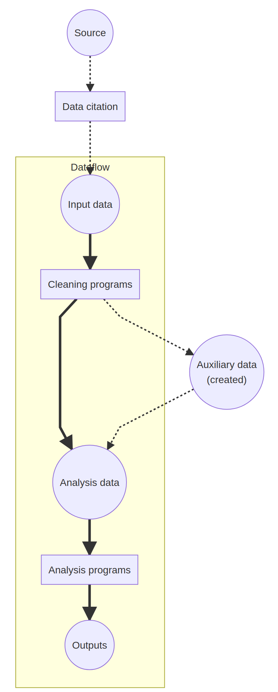
-->


Real articles are often more complex. A simple example will be discussed next.

## A simple example

At the Github repository [labordynamicsinstitute/simple-example](https://github.com/labordynamicsinstitute/simple-example), we have prepared a very simple example of a data analysis workflow. It illustrates the concepts above.

> Read the [README](https://github.com/labordynamicsinstitute/simple-example/blob/master/README.md) before going on.


We focus on the information provided in the README first:

- `Source`: Census of Population and Housing, 2000

The `source` data is identified, and a `data citation` is provided as part of the README. The README notes that the data is considered public-use, but a login is required at ICPSR, which is the distributor of the data. The data acquisition, as described, is a manual process (because it requires a login). The data is also manually unzipped, and the final location described.

> Note: this could be scripted to make part of the data acquisition code-driven.

- `Cleaning programs`: `01_dataclean.do`

A `cleaning program` is identified and described.

- `Analysis data`: is verbally described in the README ("clean merged dataset")

> Note: Could this be improved?

- `Analysis program`: `02_table1.do`
- `Outputs`: Table 1

An `analysis program` is also listed, and identified as creating `output` Table 1. An inspection of the "[manuscript](https://github.com/labordynamicsinstitute/simple-example/blob/master/text/simple-paper.pdf)" shows that only a single table is included.

So a flow diagram for the simple example might be:
<!--This figure above does not appear
```{=html}
<div class="mermaid">
graph TD;
    subgraph Dataflow;
    A(("Input data:<br/><i>ICPSR_13568-V1"</i>)) ==>  B["Cleaning programs:<br/><i>01_dataclean.do</i>"];
    B ==> C((Analysis data));
    C ==> D["Analysis programs:<br/><i>02_table1.do</i>"]
    D ==> E(("Outputs:<br/><i>Table 1</i>"));
    end;
    Z(("Source:<br/><i>Decennial Census")) -.-> X[Data citation] -.-> A;

</div>
```
-->
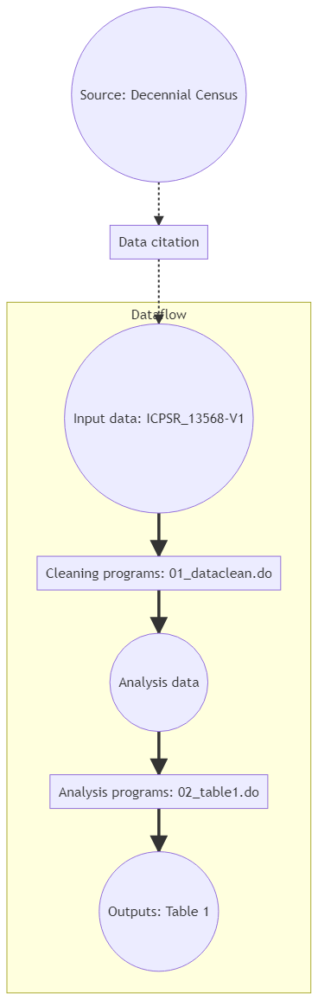

<!--chapter:end:06-basic-flow.Rmd-->

# Assessing computational reproducibility

The basic workflow is simple:

- obtain the (pre-publication) manuscript and any materials
- analyze the README, and possibly appendixes and data sections, to identify all data sources, and all processing instructions
- obtain all code
- obtain all data
- execute all code
- compare the output with the manuscript tables, figures, and in-text 

In practice, this quickly becomes more complicated, and requires a multitude of if-then instructions. At the LDI Lab, we have implemented the generic workflow within a system called Jira, which replicators use to go through the steps above. 


At each step, additional information is requested, mostly through in-app fields and questionnaires, but also via some external tools if the Jira app did not provide the functionality. At the end, a report is created by the replicator, identifying all steps taken, which steps succeeded, and the final outcome.

We will first describe the [prototypical report](#proto-report) and its elements, and then walk through the [detailed steps](#detailed-steps) of the replicator's journey through the system. In our live training, replicators will also work on examples to "get the hang of it."

<!--chapter:end:07-basic-assessing-reproducibility.Rmd-->

# A guided walk through the Replication Report

In order to work through a replication report, you will need

- [Access to computers](https://github.com/labordynamicsinstitute/replicability-training-curriculum/blob/master/Access_to_computers.md)
- Reviewed the [Template REPORT](https://github.com/AEADataEditor/replication-template/blob/master/REPLICATION.md) 
<!-- Access to computers link does not work-->

We have examples of various actual reports (slightly anonymized):

 + [Example 1](https://github.com/labordynamicsinstitute/replicability-training-curriculum/blob/master/sample_report.md)
 + [Example 2](https://github.com/labordynamicsinstitute/replicability-training-curriculum/blob/master/REPLICATION-AEAREP278.md)
 + [Example 3](https://github.com/labordynamicsinstitute/replicability-training-curriculum/blob/master/REPLICATION-AEAREP282.md) and its [revision](https://github.com/labordynamicsinstitute/replicability-training-curriculum/blob/master/REPLICATION-AEAREP282-revised.md)


## Some high-level concepts


### On data documentation

The [Social Science Data Editor's page on Data documentation](https://social-science-data-editors.github.io/guidance/Requested_information_data.html) provides guidance:

  + Identifying all data
  + What is great / good / just-good-enough data documentation
  + Citing data!

### On code documentation

The [Social Science Data Editor's page on Code and documentation](https://social-science-data-editors.github.io/guidance/Requested_information_code.html) provides guidance:

  + What do we consider to be "code"
  + Assessing the quality of the code documentation


### To come

How to modify code for replicability/verification


## What's in a replication report

The template used by the Lab can be found on Github [here](https://github.com/AEADataEditor/replication-template/blob/master/REPLICATION.md). The table of contents looks like this:

- SUMMARY &ast;
- Data description &ast;
- Data checks &ast;
- Code description &ast;
- Stated Requirements &ast;
- Missing Requirements &ast;
- Computing Environment of the Replicator
- Replication steps
- Findings
- Classification

We note that those sections marked "&ast;" can be completed before ever running any author-provided code, even when data are confidential. They lead to a preliminary report, which is a "dry" assessment of the completeness of the replication package. 

In most sections, when elements are missing, wrong, or do not work, we use a [standardized set of action items](https://github.com/AEADataEditor/replication-template/blob/master/sample-language-report.md) to highlight this. 

### Summary

The SUMMARY is intended for a quick glance by journal editor and authors. It should be short and succinct, with a bulleted (unduplicated) list of action items for the authors, drawn from the rest of the report. It is the first thing editors and authors will see. 

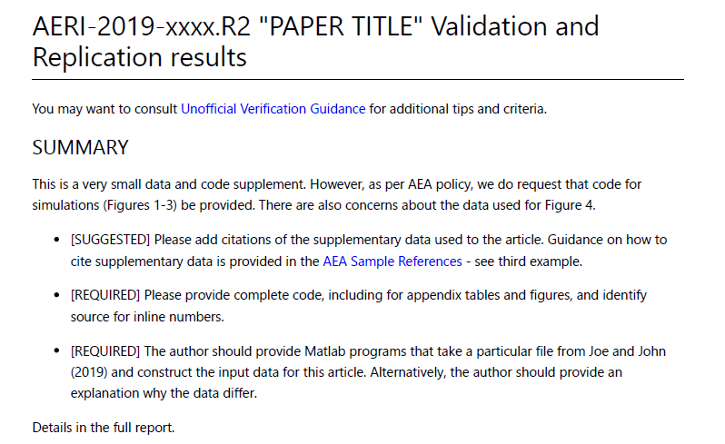

###  Data description

The data description can require substantial time to complete. The replicator is asked to identify all `input` (original) data sources used by the authors. It sometimes is useful to create a working list (spreadsheet) and commit the list together with the report. The ACRE project has a [useful template](https://bitss.github.io/ACRE/assessment.html#describe-inputs), but any list will suffice here. In addition, we ask replicators to  fill out the "Data Citation and Information report", to obtain a machine-readable list of data sources and their attributes. 

An essential part in writing the data descrption section is identifying the data used in the analysis. While the dataset used for the main analysis is often explained in the README or in the manuscript, the description of other datasets (e.g. datasets used in the appendix, introduction, or in a figure describing the study settings) are sometimes omitted in the provided documents.

Once the preparations above are completed, a summary should be written in the "Data Description" section. 

#### What data need to be described?
All "`input` (original) data sources" and "Analysis data files" should be listed. 
   
- Data needs to be listed include:
   - Any data used to produce tables, figures, and in-text numbers that presents the estimated results, summary statistics, or any other numbers that are calculated from the data
   - Data used to create maps.
      - The data source of the geographical information is a source data if the map is created by the authors. 
- Data need not be listed include:
   - Source data for the numbers or estimates directly quoted from other aritcles 
   - Souce data for the parameters used for calibrations, unless they are estimated within the article.

#### Source data

For each data source, list 

- presence or absence of source data (data files), 
- presence or absence of codebook/information on the data, and summary statistics. Summary statistics and codebook may not be necessary if they are available for public use data. In all cases, if the author of the article points to an online location for such information, that is OK. 
   - The information of the source location of the data should instruct the replicator how to access the source data.
   - A replicator should validate the provided description of the access information by visiting the link, downloading the dataset from the link, and compare the downloaded dataset with the provided dataset.
- whether the *data* is cited (see the section on [data citations](#datacitations). Note that when authors cite data supplements, both the article and the data supplement should be cited - often, the latter is missing. 

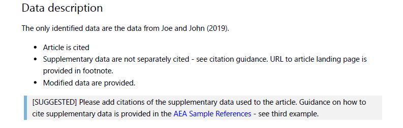

#### Analysis data files

Analysis data files are the data files from which output tables and figures are produced directly. If any analysis data files are provided and found, they are listed. Analysis data files are produced by code in the deposit from data sources. Not every deposit will have these, and in some cases, there may be ambiguity if a data source is not clearly defined. In some cases, replicators will identify surplus data - data not associated with any source and any program. Authors are then asked to clarify this information.

### Metadata checks on deposit

Most replication packages received by the LDI Replication Lab will have been deposited in the AEA Data and Code Repository, but some may be on other trusted repositories (Dataverse, Zenodo, etc.).^[See the Social Science Data Editor website for a list of trusted repositories.] The replicators are asked to verify compliance with an AEA-specific list of required elements:


- [ ] JEL Classification (required)
- [ ] Manuscript Number (required)
- [ ] Subject Terms (highly recommended)
- [ ] Geographic coverage (highly recommended)
- [ ] Time period(s) (highly recommended)
- [ ] Collection date(s) (suggested)
- [ ] Universe (suggested)
- [ ] Data Type(s) (suggested)
- [ ] Data Source (suggested)
- [ ] Units of Observation (suggested)

If all required elements are provided, then the deposit passes. 
Many of the recommended elements are not applicable to all data deposits - for instance, a simulation has no "geographic coverage" or "collection date", but a survey clearly does. 

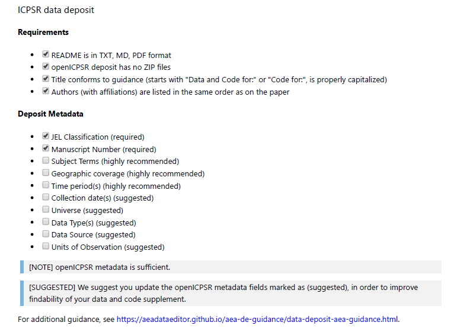

###  Data checks

When data are present, the replicator will run a few checks. These are not meant to be exhaustive, and are far less comprehensive than those suggested by trusted data curators. We ask for mostly simple checks, but which are known to fail. These are mostly checks that ensure some level of FAIR compliance.

- can data be read (using software indicated by author)? 
   - This is a plausibility check for corrupted data.
- Is data in archive-ready formats (CSV, TXT) or in custom formats (DTA, SAS7BDAT, Rdata)? 
   - Most trusted repositories will strongly suggest archive-ready formats, but there is a wide range of feasible formats. Our heuristic is that a format is "archive-ready" if it can be read by open-source software (not necessarily the original software). For instance, there are robust readers for Stata in R and Python, and so even though Stata formats are a proprietary format associated with commercial software, it is deemed acceptable. Exceptions we have found are files for Numbers (an Apple spreadsheet program that only works on MacOS) and Mathematica data files - neither have open-source readers. 
- Do the data files have variable labels and meaningful variable names? 
   - In other words, is it straightforward to understand what the data mean? Alternative, a codebook could be provided, that maps cryptic variable names (`Q25S3`) to meaningful labels. 

> Note that we do *not* require that variable *values* are provided here, nor that a full codebook is present or linked. Ideally, these would be here as well, and in some cases, we will go back to the authors and request them, *if* we think it is reasonable to do so  - a judgement call by the Data Editor.

- Replicators will run a simple check for personally identifiable information, if feasible, using a heuristic developed by J-PAL.^[The Stata version can be found [here](https://github.com/J-PAL/stata_PII_scan).] 
   - This check will have lots of false positives - fields it thinks might be sensitive that are not, in fact, sensitive. While replicators are asked to apply some judgement, the final decision must be made by authors, and the information is reported as such in the report.

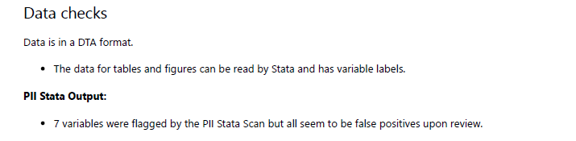


###  Code description

All deposits should have code. In line with the [basic data flow](#dataflowdiagram), there should be both data cleaning or preparation code, as well as analysis code. The replicator will review the code (but will  not run it yet). 

- Identify programs that create "analysis files" ("data preparation code"). 
- Identify programs that create tables and figures. 

From the README, the replicator should be able to identify code to create all **figures, tables, and any in-text numbers**. If not listed in the README, comments in the code should enable the replicator to find this. The replicator will create a list, mapping each of figure, table, and in-text number to a particular program and line number within the program. A [template spreadsheet](https://github.com/AEADataEditor/replication-template/blob/master/code-check.xlsx) is provided. Note that the code description might already observe that setup programs are missing, but most missing code will be identified in the [findings][findings] section. 


###  Stated Requirements

The authors should have specified specific requirements in terms of software, computer hardware, runtime, add-on packages. The replicator should list them here. This is **different** from the Computing Environment of the Replicator. If all requirements are listed, check the box "Requirements are complete". This section is important to assess the feasibility of the reproducibility attempt. A reproduction that requires "20,000 core compute hours", or that "runs for weeks", or that requires custom software that needs to be acquired, may not be feasible. 

- [ ] No requirements specified
- [ ] Software Requirements specified as follows:
   - Software 1
   - Software 2
- [ ] Computational Requirements specified as follows:
   - Cluster size, etc.
- [ ] Time Requirements specified as follows:
   - Length of necessary computation (hours, weeks, etc.)

- [ ] Requirements are complete.


###  Missing Requirements

If it turns out that some requirements were not stated or are incomplete (software, packages, operating system), the replicator should  list the *complete* list of requirements here. This is usually amended as the reproducibility attempt progresses.

###  Computing Environment of the Replicator

Just as the original authors have a particular computing environment that a replicator needs to know in order to properly implement a reproducibility attempt, the replicator's own attempt is important. This section should *not* describe the laptop the replicator uses to write the report - that is irrelevant - but should provide as complete a list of details as possible describing the computer where the computational component of the reproducibility check was conducted. S Some of these details can be found as follows:

- (Windows) by right-clicking on "My PC"
- (Mac) Apple-menu > "About this Mac"
- (Linux) see code in `tools/linux-system-info.sh`

Examples might include:

- Mac Laptop, MacOS 10.14.6, 8 GB of memory (but only if you ran the analysis on the Mac Laptop!)
- CISER Shared Windows Server 2016, 256GB, Intel Xeon E5-4669 v3 @ 2.10Ghz (3 processors)
- CISER Virtual Windows Server 2016, 16GB, Intel Haswell 2.19 Ghz (2 processors)
- BioHPC Linux server, Centos 7.6, 64 cores; 1024GB RAM; 

The list should also list the software the replicator used, with the specific version used (even if the author did not list that information). Examples include:

- Stata/MP 16
- Matlab R2019a
- Intel Compiler 3.14152


###  Replication steps

For every replication or reproducibility attempt, the list of steps a replicator undertakes is important to be listed. In principle, these steps should be specified in the README, but while the README contains instructions, this section should contain what you actually did. It should include details as to under what name the replicator saved a dataset downloaded from a website (if not the suggested name), or what minor edits were made to programs. 

- DO not include trivial details ("I downloaded the code and saved on my Desktop"). 
- DO describe actions   that you did  as per instructions ("I added a config.do")
- DO describe any other actions you needed to do ("I had to make changes in multiple programs"), without going into detail (the commit log can provide that information)

The description should allow the Data Editor and the authors to understand that everything was done as instructed. Deviations need to be described with enough detail that somebody else can reproduce the deviation!

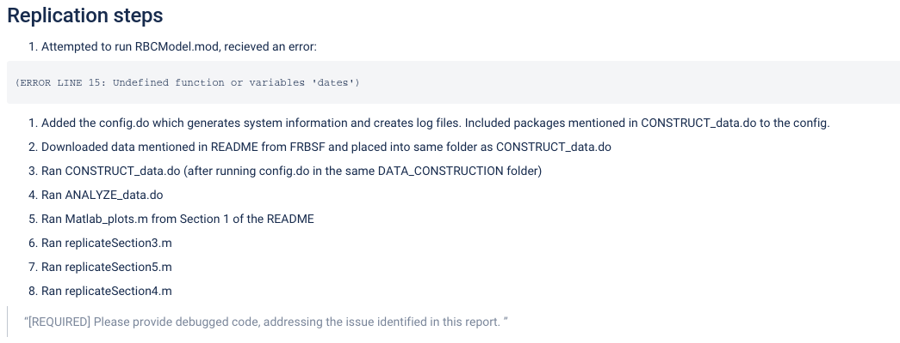

###  Findings

Once everything is put in place, the replicator can report on findings, both positive and negative. This should include enough detail to allow a reader - a Data Editor and the authors - to understand what went wrong when something went wrong. For each **Data Preparation Code, Figure, Table, and any in-text numbers**, the section should provide information on success or failure to reproduce (the previously filled out [code-check.xlsx](https://github.com/AEADataEditor/replication-template/blob/master/code-check.xlsx) can be re-used to drive the list). When errors happen, the replicator's description should be as precise as possible. For differences in figures, the replicator should provide both a screenshot of what the manuscript contains, as well as the figure produced by the code you ran, with differences highlighted. For differences in numbers (in tables or in-text), the replicator should list both the number as reported in the manuscript, as well as the number replicated. 

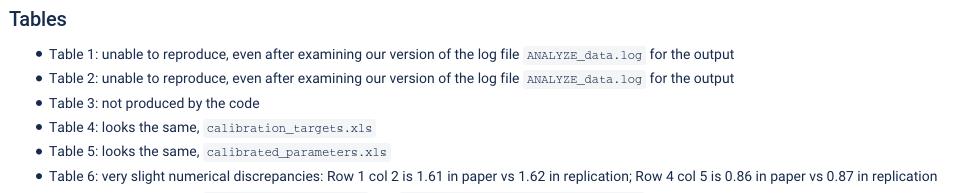


###  Classification

The replication report template used by the LDI Replication Lab uses a simplified scheme to summarize the reproducibility of the materials:

- Full replication can include a small number of apparently insignificant changes in the numbers in the table. Full replication also applies when changes to the programs needed to be made, but were successfully implemented.
-  Partial replication means that a significant number (>25%) of programs and/or numbers are different.  Note that if any data is confidential and not available, then at best a partial replication can be achieved. 
- Failure to replicate implies that only a small number of programs ran successfully, or only a small number of numbers were successfully generated (<25%). Most replication packages that rely on confidential data will also be in this category.

- [ ] full replication
- [ ] full replication with minor issues
- [ ] partial replication (see above)
- [ ] not able to replicate most or all of the results 


The Lab does not (yet) use a more refined reproducibility score, such as the one developed as part of the [BITSS ACRE Project](https://bitss.github.io/ACRE/assessment.html#score). The emphasis is on a summary measure, combined with detailed reasons why full reproducibility is not achieved.


The reasons for not being able to fully reproduce the materials can be multiple, and should be noted in the report (they are captured through a multiple-choice field in the LDI Lab's JIRA system):

- [ ] `Discrepancy in output` (either figures or numbers in tables or text differ)
- [ ] `Bugs in code`  that  were fixable by the replicator (but should be fixed in the final deposit)
- [ ] `Code missing`, in particular if it  prevented the replicator from completing the reproducibility check
- [ ] `Code not functional` is more severe than a simple bug: it  prevented the replicator from completing the reproducibility check
- [ ] `Software not available to replicator`  may happen for a variety of reasons, but in particular (a) when the software is commercial, and the replicator does not have access to a licensed copy, or (b) the software is open-source, but a specific version required to conduct the reproducibility check is not available.
- [ ] `Insufficient time available to replicator` is applicable when (a) running the code would take weeks or more (b) running the code might take less time if sufficient compute resources were to be brought to bear, but no such resources can be accessed in a timely fashion (c) the replication package is very complex, and following all (manual and scripted) steps would take too long.
- [ ] `Data missing` is marked when data *should* be available, but was erroneously not provided, or is not accessible via the procedures described in the replication package
- [ ] `Data not available` is marked when data requires additional access steps, for instance purchase or application procedure. 

Note that absence of full replication is not necessarily a reason to reject the replication package. The AEA regularly accepts replication packages that are not reproducible by the AEA Data Editor because the "data are not available" or because there is "insufficient time", as long as the replication package could plausibly be reproduced by somebody with extra time or with access to the data. The determination is made by the AEA Data Editor, based on the report. 

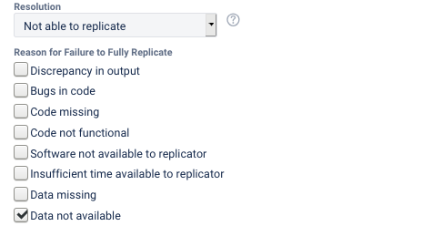

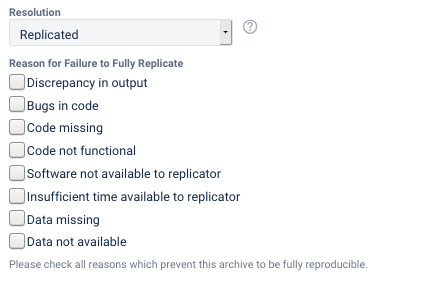

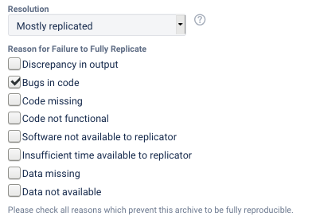

## Some additional materials

Here's a collection from older presentations:

 + [Elements of a replication report](Replication-Report-Overview.pdf)
 + [Replicator checklist](replicator_checklist.pdf)

<!--chapter:end:08-details-replication-report.Rmd-->

# (PART) AEA-specific training {-}

<!--chapter:end:10-Part-AEA.Rmd-->

# AEA Jira workflow - A guide

For pre-publication verification, we use a Jira-based workflow similar to the post-publication processes described in the [Wiki](https://github.com/labordynamicsinstitute/replicability-training/wiki).

## Scope

Your supervisor will assign you to this workflow. This workflow covers code and data, even when data may not be accessible. Supervisor, see [other document](https://github.com/labordynamicsinstitute/replicability-training/blob/master/jira-supervisor-notes.md) for details.

- This workflow **DOES NOT** cover simple metadata assessment of openICPSR deposits, for instance for AEA Papers and Proceedings deposits. See [Instructions PandP Checks](https://github.com/labordynamicsinstitute/replicability-training/blob/master/Instructions-PandP-Checks.md).

## Overview


The following table illustrates the flow and transitions. The `transition` field identifies the button that will appear in the interface
that needs to be clicked in order to progress an issue from the `From` state to the `To` state. The `Condition` field identifies
which form field needs to be filled out in order to be able to make the transition. `Blocked` is always an option, and leads to a "waiting state"
until a resolution can be found.

| From         | Transition           | → To           | Condition |
|:-------------|:---------------------|:---------------|:----------|
| Assigned     | Start task           | → In Progress  |           |
| In Progress  | Download code        | → Code         | `Code provenance` have been filled out, `Journal` has been identified, `Empirical Article`=`Yes`, `External validation` != "yes" |
| Code         | Access data          | → Data         | `Git working location`, `Data provenance` have been filled out. |
| Data         | Prepare preliminary report | → Write Preliminary Report | |
| Write Preliminary Report | Data is accessible   | → Verification  | `Location of data` has been filled out.|
| .            | Data not available   | → Code review   | `Reason for non-accessibility of data` has been filled out.|
| Verification, Code review  | Prepare report       | →	Report        | |
| Report       | Submit for review    | → Report Under Review  | `Report URL` has been filled out.|
| Multiple     | Need information     | → Incomplete   |  when information is missing |
| Incomplete   | Restart              | →  Code review |           |
| .            | Restart verification | → Verification |           |
| .            | Restart task         | → In Progress  |           |

The following are only relevant for "Approvers" or "Pre-Approvers" (if you have not been told you are a "(Pre-)Approver", you are not.)

| From         | Transition           | → To           | Condition |
|:-------------|:---------------------|:---------------|:----------|
| Open         | Assign               | →  Assigned    |           |
| In Progress  | Alternate Workflow   | →  Alternate Workflow | |
| Under Review | Approve              | →  Approved    |Can only be done by **approvers**.|
| Pre-approved | Approve              | →  Approved    |Can only be done by **approvers**.|
| Under Review | Pre-Approve          | →  Pre-Approved|Can only be done by **pre-approvers**.|
| .            | Incomplete           | →  Incomplete  | n.a.      |
| Approved     | Done                 | → 	Done       | n.a.      |
| Blocked      | Reopen               | →  Open        | n.a.      |

The following are only relevant for "Publishers"  (if you have not been told you are a "Publisher", you are not.)

| From         | Transition           | → To           | Condition |
|:-------------|:---------------------|:---------------|:----------|
| Approved     | Submit to MC         | →  Submitted to MC    | `MCRecommendationV2` is filled out          |
| Submitted to MC     | Wait for response on ICPSR | → Pending openICPSR changes | `MCRecommendationV2` is `Accepted with changes` and notes to be added on openICPSR  |
| Submitted to MC  | Prepare for publication   | →  Pending Publication | `openICPSRVersion` is filled out, issue is NOT an `R&R`|
| Pending openICPSR changes | Prepare for publication | --> Pending Publication | `openICPSRVersion` is filled out, Changes have been satisfied on openICPSR| 
| Pending Publication | Publish              | →  Published    |`openICPSRDOI` is set|


### Notes

- In the **Issue form**, please also fill out other fields, as noted.
- At any point, you can move the issue to `Incomplete`: more information/action is required before you can proceed. You should also notify us of the situation ASAP
- When committing, **always** use [Smart Commits](https://confluence.atlassian.com/bitbucket/use-smart-commits-298979931.html), e.g.
> JRA-34 #comment corrected indent issue
- Use JIRA to communicate with your supervisor as issues arise, including code that takes a long time to run. 

## Details

Additional details for each of the key stages are provided here. Below is a screenshot of a Jira ticket. Some things to note:

- The blue `In Progress` box in the upper right - area 3 of the screen - is how you "advance" the Jira ticket. When you are first assigned a replication, this box will say `Open`.
- The tall grey bar on the left side - area 1 of the screen - contains several handy links that you will use throughout the process.
    - Sometimes this box is not visible. To make it visible, edit the URL for the Jira ticket so that there are no characters after the ticket number (e.g. AEAREP-123). You may have to refresh the page after doing so.

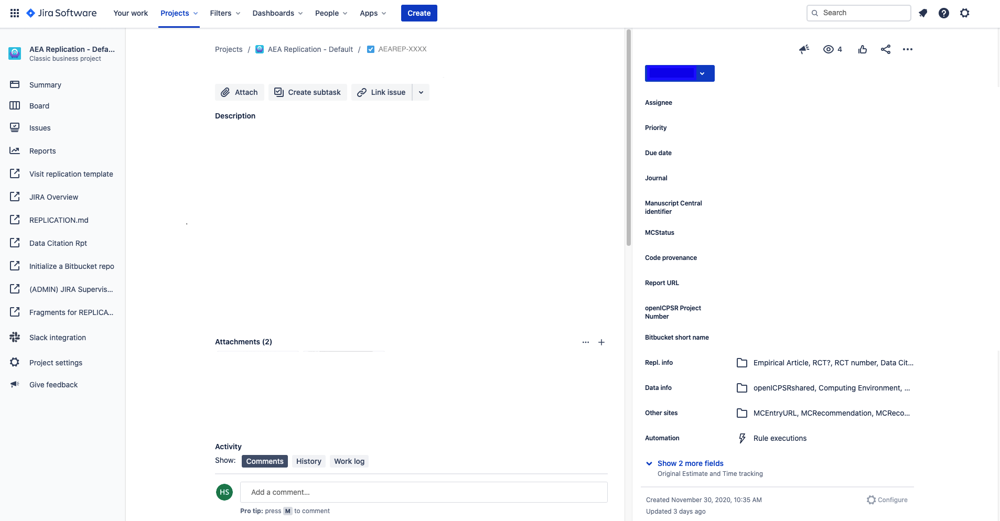

### In Progress

The first thing you must do is to advance the ticket from `Open` to `In Progress`.

- This lets us know that you have started working on replication.

At this stage, you are collecting information. 

- [ ] start by [creating a repository](https://bitbucket.org/repo/import) (for detailed instructions, see the [Wiki page](https://github.com/labordynamicsinstitute/replicability-training/wiki/Setting-up-a-repository-on-Bitbucket))
    - the repository name should be the name of the JIRA issue (e.g., `aearep-123`)
    - Be sure that `aeaverification` is always the "owner" of the report on Bitbucket. 
- [x] populate the repository with the latest version of the [template](https://github.com/AEADataEditor/replication-template) (*If you used the "Import Repository" technique outlined on the [wiki](https://github.com/labordynamicsinstitute/replicability-training/wiki/Setting-up-a-repository-on-Bitbucket), this is already done!*) 

- [ ] Clone the Bitbucket repository onto the computer you are working on (`git clone https://yourname@bitbucket.org/aeaverification/aearep-xxx.git` )
- [ ] Delete (`git rm`) unused files from the template! 
  - Example: `git rm README.md template-config.R` if the replication archive does not contain any R files (you can do this at any time before writing the **Preliminary Report**)
- [ ] From the JIRA issue, download and add Manuscript, Data and Code Availability Form (DCAF). 
    - Download from Jira issue attachments. The manuscript is often called `PDF_Proof.pdf`. 
    - Add to the root of the repository, and add them to the Git repo (e.g., `git add PDF_Proof.pdf DataCodeAvailability.pdf`)
- The root of the repository should contain only our files (i.e., REPLICATION.md, etc.) and the manuscript files (main manuscript, any online appendices and README files provided through the JIRA ticket). 
  - Example:
    ```
    code-check.xlsx
    config.do
    PDF_Proof.PDF
    PII_stata_scan.do
    DataCodeAvailability.pdf
    REPLICATION.md
    ```

- `git commit`, `git push`...
- [ ] Then fill out the following fields in the Jira ticket (some may be pre-populated):
    - [ ] `Code provenance` In almost all cases, this is the openICPSR repo for which you will have received a notification email.
      - If code and/or data are provided by email, `Code provenance` should be filled out with  "https://email", otherwise with a URL.
    - [ ] `Journal` 
    - [ ] `Manuscript Central identifier`
    - [ ] `Bitbucket short name` (e.g., `aearep-123`) 
      - this should auto-fill the `Git working location`.
- The following fields, located in the **REPL. INFO** tab area 2 of the screen, must also be filled out:
  
    - [ ] `Empirical Article`: "Does the article contain empirical work, simulations, or experimental work?" 
      - typically the answer should be "Yes". You should answer "No" only if you read the article and find that it is entirely theoretical, no simulations or empirical work at all.
    - [ ] `RCT`: Is the paper about a randomized control trial? This should be immediately obvious from the abstract.
      - `RCT NUMBER`: If it is an RCT, fill in the associated RCT registration number (typically in the title page footnote)

You can now proceed to change the status to `Code`.

### Code

In this stage, download the code or the entire replication package, and populate the Bitbucket repository.

---

> You now need to decide where you are going to do the data analysis - that should be the place you do the next few steps. 

This is because the git setup we use does not allow you to include the data files in the Bitbucket repository, so when you download the replication package from openICPSR or elsewhere, they do not get added to the Bitbucket repository.

---

- [ ] Download the code from openICPSR (typicaly for most cases). See [openICPSR repositories](https://github.com/labordynamicsinstitute/replicability-training/blob/master/openICPSR_training.md) for instructions on downloading these materials. Typically called `111234.zip`.
  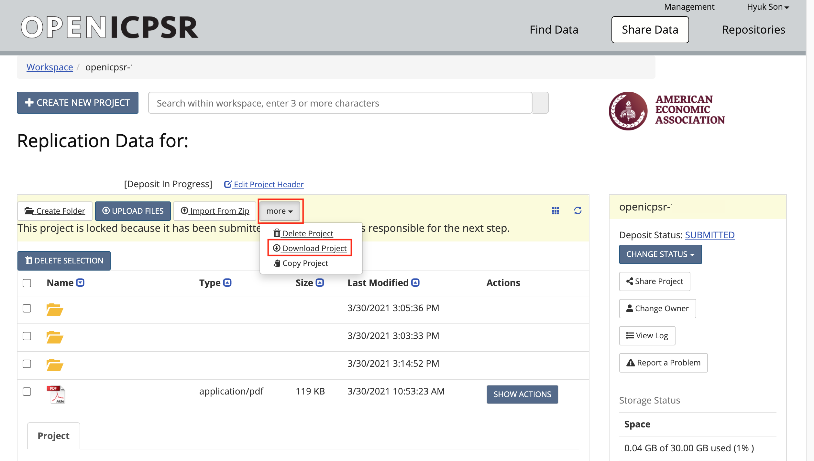
- [ ] Populate the Bitbucket repository:
  - If not already done, use `git clone` to clone the Bitbucket repository onto CISER (or your laptop, but see below). It should be named something like `aearep-123`.
    - **[EXPERT TIP]** It may be more convenient to do this FIRST on CISER, so that the data files are there. Data files are NOT committed to the repository. You can then later update the repository on your local computer.
  - Copy/paste the downloaded openICPSR folder (ZIP file) into the local copy of the `aearep-123` repository. The local repository should now have the relevant LDI replication template materials and the openICPSR folder containing the replication materials provided by the authors.
  - Unzip the openICPSR folder under a folder **named by the openICPSR repostory number**. On Windows and OSX, double-click. From bash: `mkdir 111234; cd 111234; unzip ../111234.zip; cd ..`
    - The manuscript's files should be in a subdirectory (e.g, `111234`, the openICPSR repository number). 
  - Perform a `git add`, `git commit`, `git push` sequence to populate the Bitbucket repo with the authors' replication materials (see above how to handle data).
- [ ] Also add the manuscript, and any response by the authors (if a revision)
- [ ] Be sure to `git push` it all to Bitbucket, with a meaningful commit message. After pushing to the repository, is should now look like this:

```
116941/
code-check.xlsx
config.do
PDF_Proof.PDF
PII_stata_scan.do
readme.pdf
REPLICATION.md
```

Now you will establish a **list of Datasets used** and fill out the **Data Citation and Information** report.

- Please check Data and Code Availability Form.
  - The form should be attached in the JIRA ticket. 
  - In area 2 of the screen, choose DCAF.
    - Open Data and Code Availability Form, and check if all blanks are filled out.
    - Once you checked the form, choose "Yes" from the dropdown menu of `DCAF_README_checked` cell.
    - If the answer to the following question at the bottom of the form is "Yes", then, choose "Yes" from the dropdown menu of `DCAF_Access_Restrictions`. Otherwise, choose "No".
      "Is any of the data used in this manuscript subject to access restrictions?"
  

- From the **README** provided by the authors, the **data section of the article itself**, or an **appendix**, establish a list of datasets used in the article.
- [ ] Fill out the **[Data Citation and Information](https://goo.gl/forms/3IaMu6PCG7P7WhK43)** report:
  - A [link to the report](https://goo.gl/forms/3IaMu6PCG7P7WhK43) can be found in the tall grey bar - area 1 of the ticket. If this tall grey bar is not visible, then edit the url according to the directions above.
  - [ ] Fill out the `DATA CITATION REPORT` field on Jira with the date on which you complete this report.
    - If there are more than 10 datasets that you can see, get approval from your Team Lead to fill out [this spreadsheet](https://drive.google.com/file/d/1-4Ah3AvNVmFJCs6IfjTKUrMOvZ9BHiO6/view?usp=sharing) instead (see the [printed form](https://drive.google.com/file/d/1VzS7akscWckx_TKAUy0bhufE5oVgwn1B/view?usp=sharing) for allowed categories). You should fill out the FIRST dataset on the **[Data Citation and Information form](https://goo.gl/forms/3IaMu6PCG7P7WhK43)**. At the end of the form is an upload option, where you should upload the form. The spreadsheet should then *also* be added to the repo (add, commit, push), and a note added to the JIRA comments. 
  - Use the list of datasets to guide you when filling this out.
  - [ ] **AT THE SAME TIME:** write the corresponding `Data description` section of REPLICATION.md. This should provide detail about the datasets that are not obvious from the **Data Citation and Information** .
    - If data are cited, copy and past the citation to the replication report, clarify which one you are referring to. 
  - [ ] In particular, check each provided URL, and verify if there is a **"Data Use Agreement", "Citation requirement", "License"** on the web page. Check any such data use agreement for conditions. These may require that the authors cite a particular paper, or cite the data in a particular way (check this), or that the authors may not actually redistribute (provide) the data (check this!). If you have doubts, check with your supervisor. 
- [ ] Add the list of datasets to the repository by committing the preliminary version of the REPLICATION.md (`git add`, `git commit`, `git push`)
- [ ] Fill out the `DataCitationSummary` field indicating how many data citations are in order: all, some, or none. 
- [ ] Fill out the `Data Provenance` section 
  - is the data in the openICPSR repository, or is it someplace else? "Various" is a legitimate answer if it is in various locations.
- [ ] Please refer to [Chapter 9 A guided walk through the Replication Report](https://labordynamicsinstitute.github.io/replicability-training-curriculum/a-guided-walk-through-the-replication-report.html) for more details about which datasets to be included and how to assess the provided information.

Do a first pass through the code files provided:

> Do NOT run any code!

- [ ] review the code in detail. 
- [ ] In the template, you will find *[code-check.xlsx](https://github.com/AEADataEditor/replication-template/blob/master/code-check.xlsx)*. Use this to create a list of all Tables and Figures in the paper, and use this to guide you in [REPLICATION.md](https://github.com/AEADataEditor/replication-template/blob/master/REPLICATION.md).
- [ ] Fill out the "Code Description" section of the REPLICATION.md
  - Provide some information about the program files (are there 3 Stata files? Are there 5 Matlab programs?). You will use this information to fill out the `Software Used` later as well, but provide details here.
  - Did you have difficulty aligning the README with the files? Does the sequence suggested by the programs differ from what's written in the README? 
  - Are all the REQUIREMENTS listed? How long does the author say the code will run?
  - Are there files in the archive not explained in the README?
  - **[EXPERT TIP]** You should **not** run the code at this time, only read the program code! (You can do this on your laptop)
  - Copy-and-paste the *code-check.xlsx* into the code description part, listing the programs. Omitte "Replicated?" Column in doing so. Use the [Excel-to-Markdown plugin](https://marketplace.visualstudio.com/items?itemName=csholmq.excel-to-markdown-table) for VSCode. 
    - This table will be pasted in under "Findings" again, with "Replicated?" column.

Next fill out the following fields in the Jira ticket:

  - [ ] `BITBUCKET SHORT NAME` - if not already done earlier

> Commit! 

You can now proceed to change the status to `Data`. As you select that transition, you will be asked various questions:

  - [ ] `Software Used` Start typing the name of the software program you will use for the replication. Software that have been used in the past will show up as  options (e.g. start typing "Stata" and you will see it pop up).
  - [ ] `PROGRAMSEQUENCE` Does the README tell you the correct sequence for running the code?
  - [ ] `PROGRAMSDOCUMENTATION` Are the provided programs well commented? Are they documented in the README?
  - [ ] `PROGRAMSSTRUCTUREMANUAL` Does the README note any manual changes that you need to make to the code in order for it to run?


### Data

- [ ] Download the data (if not already done in the previous step, and if available).
  - Data should be stored locally (currently) / in [Git LFS](https://confluence.atlassian.com/bitbucket/git-large-file-storage-in-bitbucket-829078514.html) (soon)
- [ ] If there is data: Run the PII-checking code, review the output, and record the result in the REPLICATION.md
  - You should check the output - it is not automatic.
  - You should use words, and examples, from the output if it looks like there is Personally Identifying Information (PII) like names, addresses, etc. in the output.
  - The author will NOT see the output from the program unless you copy **relevant** parts of it into the report.
- [ ] Describe the data 
  - [ ] do relevant variables have labels? 
  - [ ] Is the data readable?
  - [ ] Is the data in archive-ready formats (`csv` or `txt` are the preferred formats by librarians, but `dta` or `spss` are also OK; `mat` files are discouraged)

Fill out the following Jira fields:

  - [ ] `DATA PROVENANCE` Where, specifically, are you accessing the data? Typically this is the openICPSR repo URL (same as `CODE PROVENANCE`), but may be a user-provided URL or DOI. 
    - if the data is in multiple places, enter "Multiple" here, and record the details in the REPLICATION.md
  - [ ] `WORKING LOCATION OF THE DATA` Where did you put the data? Examples: CISER, laptop, or Git LFS, or somewhere else

You can now proceed to change the status to `Write Preliminary Report`. You will be asked to provide additional information:

  - [ ] `DATASETSINCLUDED` Are all datasets included as part of the replication package (on openICPSR or, if not using openICPSR, on the other repository)?
  - [ ] `DATAAVAILABILITYACESS` Do the data require users to apply for access, purchase, or otherwise sign or enter into agreements to access the data? This could be a license agreement, or even a click-through acknowledgement. (This should be mentioned in the Readme PDF or in the article) 
  - [ ] `DATAAVAILABILITYEXCLUSIVE` Are there data that are **only** accessible to the author (nobody else)?
  - [ ] `REASON FOR NON-ACCESSIBILITY OF DATA` Fill this out for **any** data that is not accessible/ not included as part of this archive; check **all** that apply. This should be clear from the authors' descriptions (in the README)
    - `Too big`: The data can be accessed elsewhere, but they are too big for this replication package
    - `Application process`: In order to access the data, an application needs to be made to an institution (not a purchase). 
    - `Cost`: It costs money to obtain the data. This may be because it has to be purchased, or because there is a fee for the application process.
    - `Confidential data`: The data are sensitive / confidential and are therefore not made available in this replication package. They can be available elsewhere, subject to conditions.
    - `Proprietary data`: The data "belong" to somebody - a company, or in rare cases, a specific author, and cannot be redistributed. 
    - `Licensed data`: A license must be obtained. This can be different than an application process (generally, less complicated).
    - `Redistribution not authorized`: Often, even if data are not confidential, not proprietary, etc., there may be redistribution restrictions. An example are some IPUMS data, as well as many others.
    - `Other download site provided`: When data can be downloaded elsewhere, possibly due to `licenses` or `application process`. In other cases, even if they could be provided, they may already be archived elsewhere, and are not included here. 
    - `Not found`: This should be checked when data cannot be found as per the instructions by the author. This is rarely a final finding for pre-publication verification.
  - [ ] `NUMBEROFDATASETS` How many datasets are used in the article (whether or not they are included in the replication package you downloaded)? This is meant to include datasets that you are asked to download, or that you were given access to via the "S:" drive, or "CRADC", or some other secure mechanism.


### Write Preliminary Report 

At this stage, you need to fill out the REPLICATION.md up to the "Replication steps" part. 

- There is sample language for commonly encountered problems at the [Fragments for REPLICATION.md](https://github.com/AEADataEditor/replication-template/blob/master/sample-language-report.md) link in the tall grey bar
  - [EXPERT TIP] Right-click, and open the sample language in a new tab, for easy reference.

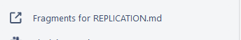

- [ ] Commit this preliminary report to the Bitbucket repository.


This stage allows for earlier identification of  issues that might warrant changes to the procedure. 

- This is the stage where you might have identified that some, but not all data are not provided, and we can undertake steps there.
- You might also have concerns about the REQUIREMENTS - the code might require software that you do not know how to use, or that is not available.
- The authors might have identified computational requirements that you do not have access to, or do not have the time to run ("compute cluster with 100 nodes", "Fortran compiler").
  - You may want to identify packages that needs to be installed. To help you with this task, we provide a tool called "scan_packages.do" for STATA programs. Instruction for using this dofile is in [Appendix G](https://labordynamicsinstitute.github.io/replicability-training-curriculum/using-scan-packages-do.html).


> Commit!

```
git add REPLICATION.md
git commit -m "Preliminary report"
git push
```

> !! If you identify any of the elements above that prevent you from completing the issue on time, you should notify your supervisor. DO NOT ADVANCE THE TICKET!!

- Otherwise, advance the ticket to one of three options: `Verification`, `Code Review`, or `Incomplete`
  - `Verification`: at least some of the data is accessible. In order to progress to this state,
    - [ ] `Working location of data`has to be filled out
    - [ ] `Computing environment` has to be selected.
  - `Code Review`: none of the data is accessible
  - `Incomplete`: more information/action is required before you can proceed

### Verification

In this stage, you are verifying the code, by using the provided data, or by inspecting the completeness of the source code. The [REPLICATION.md](https://github.com/AEADataEditor/replication-template/blob/master/REPLICATION.md) is the report.


Keep a log of what you do, what you find, and what does not work, in the `REPLICATION.md`, under *Findings*.
  - For codes using STATA, we provide a template of `config.do` in the repository. It creates log files and saves it in the repository. Instructions for using `config.do` is in the [Appendix F](https://labordynamicsinstitute.github.io/replicability-training-curriculum/using-config-do-in-stata.html)

Follow the steps [here](https://github.com/labordynamicsinstitute/replicability-training/wiki/Prepare_and_run_replication)

You should commit your report with intermediate results as you have them. Do __not__ wait until you have all the results finished. Commit frequently!

> Add (report, modified files)! Commit! Push!

You can now proceed to change the status to `Writing Report`.

### Code Review

In this stage, you are verifying the code by inspecting the completeness of the source code. In general, your ability to detect any issues is limited, but go through the code one more time, and identify 

- packages that are installed late in the code, but not mentioned in a setup program or the README
- commands that your experience shows require packages to be installed, but are not mentioned.

Note that in this stage, "Working location of data" and "Computing environment" section in the report are not relevant, so write N/A for these sections.

The [REPLICATION.md](https://github.com/AEADataEditor/replication-template/blob/master/REPLICATION.md) is the report.


> Add! Commit! Push!

You can now proceed to change the status to `Writing Report`.


### Writing Report

At this stage, you will write the final version of the report.

- There is sample language for commonly encountered problems at the [Fragments for REPLICATION.md](https://github.com/AEADataEditor/replication-template/blob/master/sample-language-report.md) link in the tall grey bar
- Clean up the REPLICATION.md - it should be factual, objective, and not written in the first person.
- Copy-and-paste the *code-check.xlsx*, including the column "Replicated?" and any notes column, into the "Findings" part. Use the [Excel-to-Markdown plugin](https://marketplace.visualstudio.com/items?itemName=csholmq.excel-to-markdown-table) for VSCode. 
- Delete all of the instructional lines in REPLICATION.md  before finishing the report.
- When there are differences: Include images of figures and screenshots of tables (both paper and as-reproduced) in the report
- Highlight differences:
    - if only a small number of table entries: mention them by table in the report
    - if a larger number: Highlight on the reproduced images (of figures, screenshots of tables) the differences you have observed
- Check that the `DataCitationSummary` field is filled out indicating how many data citations are in order: all, some, or none. 

To complete this stage, enter the direct URL of the report, i.e., in the relevant repository (if not already pre-filled):

> https://bitbucket.org/aeaverification/aearep-123/src/master/REPLICATION.md

You can now submit your report for review by changing the status to `Under Review`

## Replication Revisions

- See [revision guidance](https://labordynamicsinstitute.github.io/replicability-training-curriculum/aea-revision-reports-after-author-resubmission.html) on the Chapter 11.
- When receiving updated files from authors, do NOT create "update" or "new" directories. The current state of the repository should always correspond to the author's structure. Overwrite files, delete files. The previous state is preserved in Git. This will also tell you what files have changed.
- When running a second replication on the same archive, please be sure to have the committed "REPLICATION.md" be accurate when you commit it - do not let it contain holdover data from a previous replication attempt, as this can lead to confusion.

## Reviewing Reports

"Approvers" and "Pre-approvers" will review the reports, and finalize the Summary. In particular, approvers must select/confirm one of the recommendations (field `MCRecommendationV2`):

- **Accepted** - the manuscript moves forward in the publishing workflow on Manuscript Central, the Data Editor does not see the manuscript again.
- **Accepted with changes** - same, but some conditions may be imposed. However, the Data Editor does not need to see the manuscript again.
- **Revisions requested - manuscript ready** - Some revisions need to be made, and the Data Editor needs to see the authors' response. However, the manuscript can move forward in the publishing workflow. This is rarely used, but opens up the possibility that the managing editors can pull out a manuscript from this category to move forward, depending on the backlog for publication.
- **Conditional Acceptance** - the Data Editor expects to see a response from the authors to the report.
- **Revise and resubmit** - the Data Editor has detected a serious problem which needs to go back to the "Revise and resubmit" phase of the publishing workflow. This is only invoked if there are significant concerns as to the validity of the manuscript's conclusions based on the reproduction attempt. Rarely used.

See [Report review guidelines](https://labordynamicsinstitute.github.io/replicability-training-curriculum/aea-revision-reports-after-author-resubmission.html) and [Preapprovers](https://github.com/labordynamicsinstitute/replicability-training/blob/master/Preapprovals.md) for details.

## Publication

Once all review rounds have been completed, the last revision will lead to a recommendation of "Accepted". The Data Editor's staff prepares the openICPSR deposit for final publication. In general, this means that a note is added to the "Project Communications Log" on openICPSR, denoting the acceptance of the deposit. The AEA publication staff can subsequently move this issue forward to "Published" when the supplement has been published on openICPSR.

- The field `openICPSRDOI` is pre-filled, but should be checked by the AEA publication staff.

See [Preparing for publication](https://labordynamicsinstitute.github.io/replicability-training-curriculum/aea-interfacing-with-the-journal-management-system.html) for details.

<!--chapter:end:11-jira-workflow-training.Rmd-->

# AEA: Revision reports after author resubmission

Most pre-publication reproducibility checks require revisions from the authors. We will try to assign these revisions to the replicator for the original submission whenever possible.

## Generic Guidance 

- Most revisions will not take you much time, so please try to process them quickly!

- Revisions do not require you to repeat all of the same steps as the original replication (see below).

- **Do not create a new Bitbucket repo**. You will overwrite the original repo (the original contents will still be available -- this is why we use version control software like Bitbucket!)

- The original REPLICATION.md is a contract; if the authors fix what we ask them to fix, then they have completed their part of the agreement.
    - If new issues turn up as a result of additional materials provided, these are okay to include as [REQUIRED] changes in the revised report. 
    - If you are unsure about something, add it to the report. While reviewing your report, we can make a determination about whether or not it can be done after acceptance of the manuscript, be a suggested instead of required change, etc. 


## Writing the Revision Report 

Please be clear when writing the revision report. The report should make sense without having to refer to the previous report. 

- The body of the report should reflect the current status of the deposit. 
    - Example: if authors were missing a setup program before and now provide it, the `Code Description` section of the REPLICATION.md should be updated to reflect the inclusion of this program. 
- Replace all [REQUIRED] and [SUGGESTED] items with [We REQUESTED] and [We SUGGESTED], respectively. 
    - Note: in the summary, these tags are using bullets (`- [REQUIRED]`) - those should be changed to "quotes": `> [We REQUESTED]`
- Below each such tag, add a bullet point. Start the paragraph with "Done" if the issue was resolved, or "Not done" if not. Then explain what was done. 

An example: 

    > [REQUIRED] Please add a setup program that installs all packages as noted above. Please specify all necessary commands. An example of a setup file can be found at [https://github.com/gslab-econ/template/blob/master/config/config_stata.do](https://github.com/gslab-econ/template/blob/master/config/config_stata.do)

becomes 

    > [We REQUESTED] Please add a setup program that installs all packages as noted above. Please specify all necessary commands. An example of a setup file can be found at [https://github.com/gslab-econ/template/blob/master/config/config_stata.do](https://github.com/gslab-econ/template/blob/master/config/config_stata.do)

    - Done. A setup program has been added to the deposit, which installs all necessary packages. 

 

## Revision Workflow 

You should proceed through the [workflow](https://github.com/labordynamicsinstitute/replicability-training/blob/master/jira-workflow-training.md) as you would for an original case with some exceptions:

- You **should not** create a new Bitbucket repository. 
- You do not need to fill out a new Data Citation and Information Report.
- You _may_ not need to re-run any code.  

### In Progress 

First, advance the ticket from `Assigned` to `In Progress`. 

- [ ] Identify previous issue. 
    - You should see the previous issue listed under **Linked Issues** on JIRA. 
    - Use the previous issue, to fill in the following JIRA fields (if not already filled): 
        - `Code provenance` 
        - `Journal` 
        - `Empirical Article`
        - `Bitbucket short name`. This should be the name of the original JIRA issue (e.g. `aearep-123)`.
        - `openICPSR project number`

        

- [ ] Download the materials attached to the JIRA issue. This will typically include an updated copy of the manuscript, readme, and a response to the editor addressing the requested changes from the prior replication attempt. These should be added to the root of the repository 

- [ ] Remove obsolete files. In the root, this should be obvious (old manuscript, old README), in the copy of the code, a bit trickier, but necessary.


- [ ] Add these to the root of the repository locally, and then add, commit, and push them to the Bitbucket repository (e.g., `git add PDF_Proof.pdf readme.pdf reply_to_editor.pdf`)
  - The root of the repository should contain only our files (i.e., REPLICATION.md, etc.) and the manuscript files (main manuscript, any online appendices and README files provided through the JIRA ticket). Example:

```
code-check.xlsx
config.do
PDF_Proof.PDF
PII_stata_scan.do
readme.pdf
REPLICATION.md
reply_to_editor.pdf
```
  

- [ ] Open `REPLICATION.md` to review the requested changes from the prior replication attempt. Read the reply to the editor, if provided, to get a sense of what changes the authors made. Make a determination if the revision requires re-running code. 
    - If there were [REQUIRED] changes in the Code Description, Replication Steps, or Findings sections of the original report, you will likely have to re-run code. 
    - If the only [REQUIRED] changes were data citations or changes to the README, you should not need to re-run code. 


Change the status from `In Progress` to `Code`. 

### Code 

At this point, you may want to transition to CISER if you haven't already. You should `git pull` to ensure the changes you've made are reflected in the local version of the repository on CISER.  

- [ ] Download the updated openICPSR deposit and commit the materials to the **same Bitbucket repo as the original replication**, in the **same directory** (i.e., if the openICPSR deposit is `12345` then all updated materials will again go into the `12345` subdirectory. 
    - Example: if AEAREP-250 is a revision of AEAREP-123, then download the entire openICPSR deposit and commit it to the `aearep-123` repo on Bitbucket.
    - Overwrite any files, if requested. Pay attention to files that might have been deleted (you will have to `git rm` them). 
    - Ensure that output produced from the prior replication attempt remains in the repository. 
    - More detailed instructions for the process of updating the replication materials can be found [here](https://github.com/labordynamicsinstitute/replicability-training/blob/master/Updating_Materials.md). 

- [ ] Update the Data Description section of the report.  
   
- [ ] Update the Code Description section of the report. 

- [ ] Fill out the required JIRA fields: 
    - `Data Provenance` 

Change the status from `Code` to `Data`. 

### Data 

- [ ] Update the Data Checks section of the report, if new data have been provided. 

- Fill out the required fields in JIRA:    
    - `Working location of the data` or
    - `Reason for non-accessibility` 

Change the status from `Data` to `Write Preliminary Report`. 

### Write Preliminary report

- [ ] Ensure all sections of the report up to Replication Steps have been updated. 

- [ ] Delete sections of the report. 


Change the status from `Writing preliminary report` to `Code Review` or `Verification`. 

### Code Review or Verification 

If you have previously determined that code needs to be re-run, you should select the  `Verification` stage. 

If you have determined that code does not need to be re-run (or code is unable to be run due to lack of data), select the `Code Review` option. 

#### Re-running code 

- You **do not** need to re-verify tables/figures that were successfully replicated the first time *unless* the new code also affects them. 
- If parts of the code take a long time to run and the [REQUIRED] changes do not involve those parts, you do not need to re-run that part of the code. 
- **Be careful!** Sometimes the code will produce intermediate outputs along the way that may be needed later on. So if you skip parts of the code and cannot replicate the result(s), go back and check to see if you actually need to run all of the code.

- [ ] Run relevant parts of code, including the config.do generating system. 

- [ ] Update the Replication Steps section of the report, accordingly. 

- [ ] Update the `code-check.xlsx` file. 

- [ ] Update the Findings section of the report. 

- [ ] `git add`, `git commit`, and `git push` any new results to the Bitbucket repository. 

Change the status from `Code Review` or `Verification` to `Writing Report`. 

### Writing Report 

In this stage, you will finalize the revision report. 

- [ ] Ensure all [REQUIRED] and [SUGGESTED] items from the original report have been changed to [We REQUESTED] and [We SUGGESTED] in the body of the report. 
    - The resolution (or lack thereof) should be included as a bullet point directly below the request. 

- [ ] Ensure any new issues found are tagged with the appropriate [REQUIRED] and [SUGGESTED] tags. 

- [ ] Delete/modify any comments of the report template that are no longer true:
    - e.g. if the previous report stated "Data not cited" and the author has now added citations, then that part should state "Data is cited" or "Data is now cited".

- [ ] Delete any parts of the report template that are no longer relevant:
    - e.g. if no code changes were [REQUIRED], then delete the sections involving code, replication steps, and findings. 
    - careful however here, too: authors should only be making changes to parts that we requested changes for, but if they change things elsewhere, then you should, in fact, retain that section, and accurately describe it again. New errors *can* be introduced!

- [ ] Update the Classification. 
    - If you do not need to re-run code for the revision, keep the original classification.
    - If you do need to re-run code for the revision, update the classification appropriately.


- [ ] Incorporate all old/new requested changes and resolutions in the SUMMARY section of the report: 

    - Create sub-sections for **New**, **Unresolved**, and **Resolved** issues. 
    - Replace all previously `- [REQUIRED]` and `- [SUGGESTED]` items in the SUMMARY section with `> [We REQUESTED]` and `> [We SUGGESTED]`, respectively. New issues should still have the `- [REQUIRED]` and `- [SUGGESTED]` tags. 
    - Below each item, include the same resolution you listed in the body of the report. 

## An example

```
SUMMARY
-------

### New 

- [REQUIRED] Please provide debugged code, addressing the issues identified in 
  this report.

### Unresolved 

> [We REQUESTED] Please add data citations to the article. 
  Guidance on how to cite data is provided in the 
  [AEA Sample References](https://www.aeaweb.org/journals/policies/sample-references) 
  and in [additional guidance](https://social-science-data-editors.github.io/guidance/addtl-data-citation-guidance.html#confidential-databases).

- Not done. Please add data citations to the manuscript for the 
  following data sources: data source 1, data source 2. 

### Resolved 

> [We REQUESTED] Please add a setup program that installs all 
  packages as noted above. Please specify all necessary commands. 
  An example of a setup file can be found at 
  [https://github.com/gslab-econ/template/blob/master/config/config_stata.do](https://github.com/gslab-econ/template/blob/master/config/config_stata.do)

- Done. A setup program has been added to the deposit, which 
  installs all necessary packages.
```


Finally, don't forget to `git add`, `git commit`, and `git push` the new report. Then, change the status in JIRA from `Writing Report` to `Report Under Review`.  

<!--chapter:end:12-jira-revision-guidance.Rmd-->

# AEA: Interfacing with the Journal Management System

> The AEA uses ScholarOne (also known as Manuscript Central) as its Journal Management System (JMS), but the guidelines below will work for any email-based system. A more integrated approach is probably preferred.

## Basic setup

In the JMS, the Data Editor is set up as a reviewer who can be assigned during the conditional accept stage. Assignment is via email to a pre-configured email address. Once the Data Editor has finalized the replication report, a manual upload is required to submit the report. If the report requires a revision, a note may need to be posted on the openICPSR deposit as well. If the report requires no revisions, a note is made on the openICPSR deposit to confirm that everything is in order.

<div class="AEA">
<h2 id="permissions" class="unnumbered">Permissions</h2>
<ul>
<li>submitters needs password to ScholarOne (Lars shares via LastPass)</li>
<li>submitters need permissions on openICPSR (Lars requests from openICPSR)</li>
<li>submitters need <code>Publisher</code> permission on Jira (can be set in Project -&gt; Settings -&gt; People in Jira)</li>
</ul>
</div>

## Submitting to the JMS

> Reminder: for the AEA, the JMS is ScholarOne.

1. Open the issue on JIRA. It must be `Approved`.
2. Click on the `Submit to MC` transition. A pop-up will be shown.

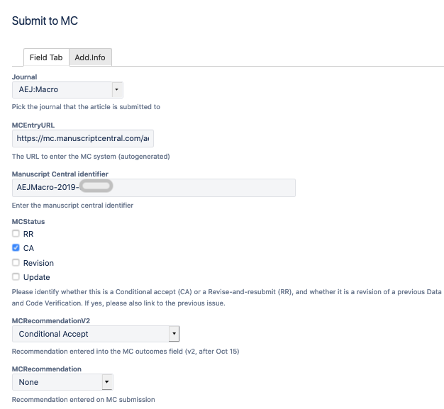

3. In the pop-up, you should have all the necessary information
   - Note: links in the pop-up window are not clickable: double-click, then use right-click to `Open in New Tab`
   - `MCEntryURL`  has the link to Manuscript Central (MC) in order to submit
   - `Manuscript Central Identifier` to find the manuscript
   - Field [`MCRecommendationV2`] has the information about how the editorial office should proceed, to be selected in the JMS
      - In cases where `MCStatus` contains `RR`, the information will be in field [`MCRecommendation`]
   - Field [`Git working location`] has the information to clone the repository (and thus be able to access the report)
4. If necessary, clone the Bitbucket repository associated with the issue 
   -  If not already created, make a `REPLICATION.pdf` file from the markdown `REPLICATION.md` using Visual Studio Code, then commit and push!
5. Open the Manuscript Central link (double-click, right-click, open in new tab)
   1. Enter your credentials to access Manuscript Central (if using LastPass, let LastPass fill the information)
   2. Click on the review tab and identify the manuscript number (`Manuscript Central Identifier`) of the paper
   3. Select `Continue Review`
   4. Always click `Yes` when asked: Would you be willing to review a revision of this manuscript?
   5. Select the recommendation as noted in the Issue
      - If `MCStatus` contains `CA`: Look at the field [`MCRecommendationV2`]
      - If `MCStatus` contains `RR`: Look at the field [`MCRecommendation`]
   6. Copy-paste the "Summary" part from `REPLICATION.md` into the field `Comments to the Author`. 
      - If not already present, add "Details are in the full report."
      - If not already present, add
   <div class="bbox">
   <blockquote>
   <p>[NOTE] Starting July 1, 2021, we will start to publish replication packages as soon as all requested changes to the deposit have been made. Please process any requested changes as soon as possible.</p>
   </blockquote>
   </div>
   7. Select and upload the `REPLICATION.pdf`, click on `For author and  editor`.
   8. In some cases, the Data Editor will have put a note in the issue with a "for Editor only" file. The contents of that file should be copied and pasted into the field `Confidential Comments to the Coeditor`.
   8. Re-verify all information
   9. Click on `Submit`
6. Back in the pop-up, 
   1. Click on `Submit to MC`


## Decision point?

If 

  - [`MCStatus`] contains `CA` and [`MCRecommendationV2`] = `Conditional Accept`, or
  - [`MCStatus`] contains `RR`

then proceed to [Request revisions].

Otherwise, if  [`MCStatus`] contains `CA` and [`MCRecommendationV2`] = `Accept` or `Accept with changes`
then proceed to [Preparing Deposit for Publication].

## Request revisions

In principle, once the report is uploaded, the author will get the report with the requested revisions via ScholarOne. However, under the post-August 2020 workflow on openICPSR, the project may need to be unlocked for the author to make changes.
To do so, proceed as follows:

1. Open the issue on Jira
2. Right-click on the [`Code Provenance`] field to open the openICPSR deposit.
3. On openICPSR, 
   - verify what the openICPSR `Deposit Status` is (top right corner) 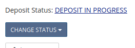.
   - if  `Deposit Status` = *`Deposit in Progress`*, you are done on openICPSR. Go back to the Jira issue
   - if `Deposit Status` = *`Submitted`*, then
      - click on `Change Status`, choose `Request revisions`
  - in the pop-up, paste and submit the following lines: 

<div class="bbox">
<p>Revisions requested. Details in the full report, which has been sent to the Editor in charge of your manuscript.</p>
<blockquote>
<p>[NOTE] Starting July 1, 2021, we will start to publish replication packages as soon as all requested changes to the deposit have been made. Please process any requested changes as soon as possible.</p>
</blockquote>
</div>

4. Back in the Jira issue, transition the issue to `Done`.


## Preparing Deposit for Publication
 

### FOR ACCEPT WITH CHANGES

1. Open the issue on Jira
2. Click on the `Wait for response on openICPSR` transition to `Pending openICPSR changes`. 
  - In the pop-up, you should have all the necessary information.
     - Note: links in the pop-up window are not clickable: double-click, then use right-click to "Open in New Tab".
     - If not already done: `Code provenance` should point to openICPSR. If not, go to the final step.
     - Make a note of the issue number (in the URL) and the `Manuscript Central identifier` again.

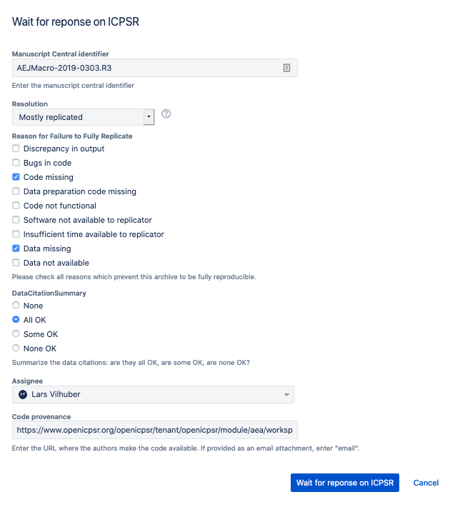

3. Look for a file "for openICPSR.md" in the repository.
4. On openICPSR, 
  - (new!) verify what the openICPSR `Deposit Status` is (top right corner) .
5. On openICPSR, if `Deposit Status` = *`Deposit in Progress`*
   - start a message in the Communication log:
      - with subject line: `Please make the following changes (AEAREP-xxx)` (replace with appropriate numbers)
      - Message content: 
         - the contents of the repository-specific "for openICPSR.md" **OR** the portion of the report after "`Action Items (openICPSR)`"
         - then the following lines (which may already be present in the "for openICPSR.md")

<div class="bbox">
<p>Details in the full report, which you will receive via ScholarOne shortly. Please provide your response to the items listed above via the openICPSR Project Communication log, specifying AEAREP-xxx. Other items in the report may need to be addressed via ScholarOne.</p>
<p>Once all changes have been made, please change the status of your deposit to “Submit to AEA”.</p>
<blockquote>
<p>[NOTE] Starting July 1, 2021, we will start to publish replication packages as soon as all requested changes to the deposit have been made. Please process any requested changes as soon as possible.</p>
</blockquote>
</div>
(replace xxx with the issue number)

6. On openICPSR, if `Deposit Status` = *`Submitted`*:
  - click on `Change Status`, choose `Request revisions`
  - in the pop-up, 
    - paste the the contents  of the repository-specific "for openICPSR.md" **OR** the portion of the report after "`Action Items (openICPSR)`"
    - then the following lines: 

<div class="bbox">
<p>Details in the full report, which you will receive via ScholarOne shortly. Please provide your response to the items listed above via the openICPSR Project Communication log, specifying AEAREP-xxx. Other items in the report may need to be addressed via ScholarOne.</p>
<blockquote>
<p>[NOTE] Starting July 1, 2021, we will start to publish replication packages as soon as all requested changes to the deposit have been made. Please process any requested changes as soon as possible.</p>
</blockquote>
</div>
(replace xxx with the issue number)
 

### FOR ACCEPT:
1. Open the issue on Jira
2. Click on the `Prepare for publication` transition
3. In the pop-up, you should have all the necessary information.
   - Note: links in the pop-up window are not clickable: double-click, then use right-click to "Open in New Tab".
   - If not already done: `Code provenance` should point to openICPSR. If not, go to the final step.
   - Make a note of the issue number (in the URL) and the `Manuscript Central identifier` again.
4. On openICPSR,
   - remove any RAs from the Share list (leave anybody else who is on there!)
   - (new!) verify what the openICPSR `Deposit Status` is (top right corner) .
5. On openICPSR, if `Deposit Status` = *`Deposit in Progress`*
   - start a message in the Communication log:
      - with subject line: `Data and Code Deposit accepted for MCNumberXXX AEAREP-xxx` (replace with appropriate numbers)
      - with body
      
\BeginKnitrBlock{bbox}<div class="bbox">This data and code deposit is accepted.

Action items:

 - Author: Please change the status of your deposit to "Submit to AEA"
 - AEA Staff: update DOI, Vol, Iss, Year of related publication, then publish.</div>\EndKnitrBlock{bbox}

6. On openICPSR, if `Deposit Status` = *`Submitted`*:
  - start a message in the Communication log:
      - with subject line: `Data and Code Deposit accepted for MCNumberXXX AEAREP-xxx` (replace with appropriate numbers)
      - with body
      

\BeginKnitrBlock{bbox}<div class="bbox">This data and code deposit is accepted.

Action items:

 - Author: no further action required
 - AEA Staff: update DOI, Vol, Iss, Year of related publication, then publish.</div>\EndKnitrBlock{bbox}

7. Back in the Jira popup, finalize by clicking `OK`. The issue will be moved to `Pending Publication`.
8. You are not quite done yet! You will receive an email from openICPSR.  
   - the email needs to be forwarded to *dataeditor-queue@aeapubs.org* 
   - manually add the **issue number** (AEAREP-xxx) into the subject line
   - delete anything in the body of the email before the "From:" 
   - This will add the message to the Jira ticket.

> - ICPSR does not always successfully send out a notification email for the posting of the comment. If you don't receive the email, as a last resort, simply copy and paste your ICPSR comment into the Jira ticket so that we have a record.

<!--chapter:end:13-jira-prepare-publication.Rmd-->

# AEA: Instructions for Papers and Proceedings checks

You will be assigned a Jira issue. It should look something like this:

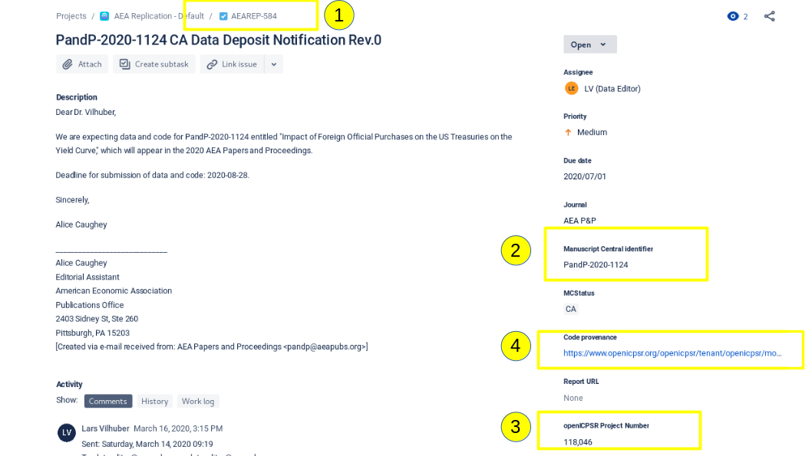

Take note of the 4 highlighted fields:

-   \(1) the "AEAREP" number (identifier for the issue on Jira)

-   \(2) the "Manuscript Central Number" (identifier on the AEA's editorial system)

-   \(3) the "openICPSR Project Number" (identifier on the ICPSR system)

-   \(4) the link for "Code Provenance", which should direct you directly to openICPSR

Additionally, certain steps below (i.e. transitioning to "Pending Publication") require that you have "Publisher" permission in Jira. If it is unclear whether or not you have that permission, please reach out to a supervisor.  

> Here's the [guidance document](https://aeadataeditor.github.io/aea-de-guidance/data-deposit-aea-guidance.html)

## Step 1

You should now do the following:

-   Open the link in (4) on openICPSR

    -  If you need to find the openICPSR repository, use [this link](https://www.openicpsr.org/openicpsr/tenant/openicpsr/module/aea/reports)
    
<!-- -->

-   Open the form: [link here](https://docs.google.com/forms/d/e/1FAIpQLSfcc4JDJsHRHZpkdBuNwbjYusjIsbSTXK6pZyuUBC7HyUW8iQ/viewform?usp=pp_url)

-   Assess the openICPSR repository, filling out the form as you go along

    -   It is important that you enter the AEAREP and Manuscript numbers accurately. We suggest copying-and-pasting.

-   Submit the form.

- Close the form after each issue, and open it again for the next one.

- Navigate to the "PandP Docs" Google Drive folder [here](https://drive.google.com/drive/folders/1h5AiNQjlCTGPU3bICpqGoNqorzlc8yPb), locate the PDF with the Jira ticket of the case you are working on (PDF format: `Report-PandP-AEAREP-xxxx.pdf`), and download the file. This is the PDF version of the checklist form using the information you entered.

In Jira:

-   Move the issue forward by choosing "**Process PandP**" to status
     "*Submitted PandP Form*"
    -   This indicates that you have completed the form.
-   Attach the downloaded PDF to the Jira ticket.

## Step 2

Once the form PDF has been added to the issue, you should first return to the openICPSR repository, and then come back to Jira. Depending on what's on the form, proceed to do one of the following:

### If the form has all "required" elements checked, you should "sign off":

#### On openICPSR
- Write a "Project communication log" entry. After clicking on "+ add entry", copy the following to the relevant cell. Update AEAREP number accordingly.
    -   *Subject line:* AEAREP-xxx Data and Code Deposit for P&P submission accepted

    -   *Content*: Thank you for uploading your code and data. This
         deposit is accepted. No computational verification was
         conducted, only compliance with required metadata was checked.

#### Back in Jira
- Move it through the workflow

    -   Choose "**Prepare for publication**"
        -   Resolution: *Evaluation only*
        -   MCRecommendationV2: *Accept*

### If the form does not have all "required" elements checked, make the following entry:

#### On openICPSR
1) If `Deposit Status` = `Deposit in Progress`, 
- Write a "Project communication log" entry

    -   *Subject line:* AEAREP-XXX Modifications to make to your P&P
        deposit

    -   *Content:* Thank you for uploading your code and data. We have
         checked the deposit for compliance with the required metadata
        elements. Please see the attached form for modifications to
         make.

    -   Attach the PDF from the issue to the communication log.

2) If `Deposit Status` = `Submitted`, 
- Change the status of the deposit to "Request Revisions" with the note:
    -   Please see the attached form for modifications to make.
    
-   Write a "Project communication log" entry

    -   *Subject line:* AEAREP-XXX Modifications to make to your P&P
        deposit

    -   *Content:* Thank you for uploading your code and data. We have
         checked the deposit for compliance with the required metadata
        elements. Please see the attached form for modifications to
         make.

    -   Attach the PDF from the issue to the communication log.


#### Back in Jira,
- Choose "**Wait for openICPSR response (PandP)**"
    -   Resolution: "*Evaluation only*"
        -   MCRecommendationV2 = "Accept with changes"

-   Later, once the issues have been resolved (typically days or
        weeks later) follow the process under "required elements
        checked"

<!--chapter:end:14-Instructions-PandP-Checks.Rmd-->

# AEA: Reproducibility Checks in Codeocean

The workflow should be the same up until the verification stage, at which point you will use Codeocean to run the reproducibility check, as opposed to running directly in the statistical software. You can run Codeocean on your personal workspace or on CISER.

## Create a Capsule

- First, create your own account on Codeocean using your cornell.edu email address (it's free). 
- In Codeocean, create a new capsule. Name the compute capsule as "`AEAREP-xxxx Compute Capsule for: TITLE`"
Example:

> AEAREP-1974 Compute Capsule for: Waiting to Choose: The Role of Deliberation in Intertemporal Choice

- Share your CodeOcean capsule with `dataeditor@aeapubs.org` (make sure to give edit permissions).

## Environment

- Set up the environment specified by the authors. This includes software, version of that software, and any dependencies (packages). 
Example:
`Stata(16) with ssc packages estout and boottest`


## Files and Directories

- There are only three directories in the Codeocean environment: `/data`; `/code`; `/results`.
    - All paths in the code must refer to one of these directories.
    - If the authors set their own globals, you change the globals to reflect these directories.
    - If the authors do not use globals, you should make the code more reproducible by setting globals in the `config.do` and amending the paths in the authors' code. Example:
    `use "D:\Dropbox\Data for paper\x.dta"` becomes `use "$data/x.dta"` where `$data` is defined in `config.do`: `global data "/data"`.

- Upload the code  to the `/code` and the data files to the `/data` directories in Codeocean.

- Define the default `run` file using the dropdown menu to the right of the file. This will create a new file (called `run`) which is a Bash script that CodeOcean uses to run all of the other code. 

    

- Which file to use for the automatic creation of the `run` file depends on your manuscript:
    - If the manuscript has a single master file (e.g., `master.do`), use that. The `run` file will then look like 
    ```
    #!/usr/bin/env bash
    set -ex

    # This is the master script for the capsule. When you click "Reproducible Run", the code in this file will execute.
    stata-mp -q do master.do "$@"
    ``` 
    - If the authors provide instructions on a specific order in which to individually execute programs, each program will need to be added to the "run" file in that order. In this case, you should be including the `config.do` at the top of each program instead of only the `Master.do`. 
    ```
    #!/usr/bin/env bash
    set -ex

    # This is the master script for the capsule. When you click "Reproducible Run", the code in this file will execute.
    stata-mp -q do 01_step1.do "$@"
    stata-mp -q do 02_step2.do "$@"
    stata-mp -q do 03_step3.do "$@"
    stata-mp -q do 04_step4.do "$@"
    ``` 

## Log files

- As with any case, if the authors' code creates log files, you can comment out the log file creation in the `config.do`. 
- Any code that generates logfiles (this includes the `config.do`) needs to be amended to write to the `results` directory (i.e. `global logdir "/results"`). 
- Note that CodeOcean automatically generates a capture of all screen output in a file called "`output`" in the `results` directory. In many cases, this will be sufficient.

## Output

- Nothing is captured unless it is *explicitly* exported to the `/results` directory.
    - For example, you will not see any graphics files saved by the code unless they are saved as something such as `/results/figure1.gph`. 
    - You may not need to do this for intermediate data files. The program(s) should still run as long as the files are successfully created.
    - All tables and figures need to be adjusted to write to "`/results`". The best way is to use a global (yet again defined in the `config.do`), e.g. `graph export "$figures/figure1.pdf"`.

## Notes

- Note that some features will not work on CodeOcean if they rely on graphical windows (see LINK TO CODEOCEAN SITE)
  - A particular feature missing from Stata 16.0 on CodeOcean is the ability to write PNG graphics. Write PDF instead.

## Recording runs 

- Once you have finished editing and running the code in Codeocean, you should download the edited code and commit it to the repository. The best way to do this is similar to the steps taken during a revision (LINK TO INSTRUCTIONS FOR REVISION). Delete, by hand (**NOT** git rm), the code files as you downloaded them onto your workspace. Then, place the amended codes into that same directory. Git add, commit, push. We should then be able to identify the changes you made to the code in order to run it on Codeocean. See further guidance [here](https://github.com/labordynamicsinstitute/replicability-training/blob/master/Updating_Materials.md).

- Download the `/results` directory and add it to the repository.

## Jira

- The `Computing Environment` and `Working location of the data` should be "Codeocean"
- Add the CodeOcean shareable URL to the issue


<!--chapter:end:15-reproducibility-check-on-Codeocean.Rmd-->

# AEA: Monitoring Pending openICPSR Changes

## Background

Many cases which the Lab reviews receive a recommendation ([`MCRecommendationV2`] on Jira) of `Accept - with Changes.` What this means is that the changes which are requested do not constitute a complete revision from the authors. Instead of re-submitting a complete revision for review by the Lab, the authors will make any necessary changes to the deposit directly on ICPSR. Separately, any changes to the manuscript/appendix will be made at the copyediting stage by the editorial office, without further interaction with the Lab.

It is important to understand how the submission process works once the final report has been approved. The RAs responsible for this process are following the instructions in [Chapter 13](aea-interfacing-with-the-journal-management-system.html). If you are not yourself involved in that process, please review those instructions. Briefly, cases that are designated as `Accept - with Changes` will have the reproducibility report submitted to ScholarOne (aka Manuscript Central (MC)), the Jira ticket will be moved into status `Pending openICPSR changes`, and the ICPSR deposit will have been unlocked so that the authors can make changes, with comments to that extent in the "Project Communication Log." 

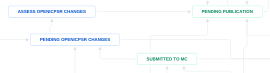

The openICPSR deposit is subsequently regularly monitored. Authors may contact the Data Editor as well. When it is clear that edits have been made to the deposit, the Jira issue is moved to `Assess openICPSR changes`. The Data Editor then needs to verify that all of the `[REQUIRED]` tags have been completed. The RA conducting that check can review the required changes both in the full report on Bitbucket and in the Project Communication Log in ICPSR. 

The evaluation process usually does **NOT** require running any code. In most cases, these are minor changes, such as adding software dependencies or data access instructions to the README. Some cases will involve minor debugging issues, for which the Lab  only checks to see that edits to the code have been made as identified in the report. Unless specifically instructed to do so by the Data Editor, no code needs to be run.

## Process

As RA tasked with this, these are the instructions.

### Verifying if changes have been made

- A good place to start in this process is to go to the openICPSR deposit (fields [`Code Provenance`] or [`openICPSR alternate URL`]) 
- First, verify the data of the last request made to the author, in the "Project Communication Log" area. The Project Communication log always contains our request to the authors, and may contain subsequent responses from the author.


- Now open the project log:  click "View Log" under "Share Project" and "Change Owner." 


- This log will tell you all the changes that have been made to the deposit and when. From here we can tell whether or not the authors have made any changes since we originally requested the revisions. 
- Additionally, this is a great resource for checking which program files the authors have made changes to. 

### If changes have been made

Once you have ascertained that changes have been made, move the Jira ticket to `Assess openICPSR changes`. 


### Verify Requested Changes

You should now open the report, and verify the changes made by the author. How to do this will vary. In some cases, you may be able to simply inspect the deposit, in others, you may need to download the deposit again, and verify the changes made, as you might do for a full revision (see [Revision Reports](aea-revision-reports-after-author-resubmission.html)).

- Open the report. You can do this by checking out the Bitbucket repo, or by clicking on the [`Report URL`] field.
  - Check the "Summary" (at the top), as well as the "Reason for incomplete reproducibility" (at the bottom, and in the Jira issue)
- Verify the changes.
- For each change, you should make a note of what problem was addressed. For instance, if the "Reason for incomplete reproducibiliy" notes that the code contained fixable bugs, and the authors have made the changes noted in the report, then you will want to  uncheck the box "Bugs in code"
  - You can find the "Reasons for incomplete reproducibility" in the "Repl.info" tab in the Jira ticket, or in the popup when moving from `Assess openICPSR changes` to `Pending publication` at the end of this process.
- If you have verified that all the required changes have been made, move forward with the acceptance process, by moving the issue to `Pending publication` (see [**Chapter 13.5.2**](aea-interfacing-with-the-journal-management-system.html#for-accept)).
  - You have another opportunity to uncheck any boxes here that have been addressed.


### Insufficient Changes

- If, in your review, you find that not all changes have been made, or it is unclear whether or not certain changes are acceptable/sufficient, please reach out to the Data Editor with a comment on the Jira ticket outlining your question. 
- These cases are not always cut and dry, please err on the side of caution and ask questions before posting a "final acceptance" message on the deposit.

### No Changes

- If no changes have been made to the deposit **four weeks** after requesting revisions, start a message in the Communication log:

    - with subject line: `AEAREP-xxx Data and Code Deposit Revisions Reminder` (replace with appropriate numbers)
    - with body
<div class="bbox">
<p>Authors,</p>
<p>Please make the revisions requested to the ICPSR deposit so that we may move forward with publication of the deposit.</p>
<p>See our previous comment above and our full report for details. Feel free to contact us directly at <a href="mailto:dataeditor@aeapubs.org" class="email">dataeditor@aeapubs.org</a> with any questions.</p>
<blockquote>
<p>[NOTE] Starting July 1, 2021, we will start to publish replication packages as soon as all requested changes to the deposit have been made. Please process any requested changes as soon as possible.</p>
</blockquote>
<p>Thanks!</p>
</div>
- Make a note in the Jira ticket that such a message has been posted.
- If after an additional **four weeks** still no changes have been made, make a note in the Jira ticket, tagging/ alerting the Data Editor.

## Notes

- **A note on [SUGGESTED] items**. We, of course, attempt to get authors to make their deposit as reproducible as possible. Which means suggesting improvements such as creating a `master.do` or including code to automatically export results. However, they are only suggestions. In other words, they do not impede reproducibility and thus we do not require that the authors make those changes. If the only changes not made to the deposit were [SUGGESTED], move forward with acceptance. 

- **A note on deposit status**. When an ICPSR deposit has a status of "Submitted" it is locked. This means that the authors will not be able to make any changes. If the deposit status is "Deposit in Progress" or "Revisions Requested" the deposit unlocked and changes may be made. Review the submission instructions above for information on how to unlock a deposit. 

- When authors ask if they need to re-submit the updated manuscript to ScholarOne/Manuscript Central. Paste the following within the acceptance (or reminder) post on ICPSR:

<div class="bbox">
<p>At this stage, any changes to the manuscript are handled directly with editorial office – another submission to Scholar One is not necessary. If you are not already in contact with the editorial office, please reach out to the managing editors via <a href="mailto:aejaccept@aeapubs.org" class="email">aejaccept@aeapubs.org</a> or <a href="mailto:aeraccept@aeapubs.org" class="email">aeraccept@aeapubs.org</a>.</p>
</div>

<!--chapter:end:16-Pending_ICPSR.Rmd-->

\cleardoublepage

# (APPENDIX) Appendix {-}


<!--chapter:end:90-Part-Appendix.Rmd-->

# Setup Checklist {#checklist}

## Accounts you will need to sign up for (action required)

- [ ] CCSS-RS account (for computing access) - [Select "Apply for Research account" and list Lars as a sponsor.](https://ciser.cornell.edu/computing/request-an-account/) Do not select "*Request Secure Data Services account*". If prompted about using sensitive or restricted data, please select "*No*". Otherwise, this will take you to a window to sign up for a CRADC account instead, which is not necessary. If you encounter this issue, please email the [CISER help desk](https://ciser.cornell.edu/consulting/ciser-helpdesk/) asking them cancel the CRADC account request. 
    - (no installation necessary on Windows, as it is pre-installed)
    - If using a Mac and if "*Microsoft Remote Desktop*"  is not already installed on Mac, install [Remote Desktop Software from iTunes](https://itunes.apple.com/us/app/microsoft-remote-desktop-10/id1295203466) 
    - Once an account is set up, learn [How to log on to CCSS-RS](https://ciser.cornell.edu/computing/computing-help/how-to-login/) (also includes download links).

> You must try this out before the first day of training! If you run into any issues, contact the [CCSS-RS helpdesk](https://ciser.cornell.edu/consulting/ciser-helpdesk/) at [CCSS-ResearchSupport@cornell.edu](mailto:CCSS-ResearchSupport@cornell.edu)

- [ ] You will need [openICPSR account](https://www.icpsr.umich.edu/cgi-bin/newacct), in order to download pre-publication materials. Please be sure to use your Cornell e-mail!

## Accounts you will be signed up for (no action required)

- [x] Atlassian account
    - Bitbucket for access to the [internal Git repos](https://bitbucket.org/aeaverification/)
    - Jira account for the [internal issue tracker](https://aeadataeditors.atlassian.net/)
- [x] Email is used for the mailing list [ldi-lab-l@cornell.edu](mailto:ldi-lab-l@cornell.edu) 

## Software to install on your laptop

- [ ] Windows Remote Desktop (see above)
- [ ] Git command line tool ([download the software](https://git-scm.com/downloads), then follow the guide on [Installing Git on your computer](https://github.com/labordynamicsinstitute/ldi-lab-standards/wiki/Setting-up-Git)
- [x] Command line (We will use the "Bash shell", but PowerShell will work, too) 
    - Windows: "Git bash" comes with the Git install above. You could also use [WSL2](https://docs.microsoft.com/en-us/windows/wsl/install-win10) (OPTIONAL, Pro)
    - macOS: Use the "Terminal" app (pre-installed)
    - Linux: Use any "terminal" app (typically pre-installed)
- [ ] Visual Studio Code ([download location](https://code.visualstudio.com/)), a powerful text editor
    - [ ] Set up [settings sync](https://code.visualstudio.com/docs/editor/settings-sync) (OPTIONAL, recommended)
    - [ ] Install Plugins:  [Excel to Markdown table](https://marketplace.visualstudio.com/items?itemName=csholmq.excel-to-markdown-table)
    - [ ] Install Plugins:  [Markdown Preview Enhanced](https://marketplace.visualstudio.com/items?itemName=shd101wyy.markdown-preview-enhanced)
    - [ ] Install Plugins:  [Auto-Open Markdown Preview](https://marketplace.visualstudio.com/items?itemName=hnw.vscode-auto-open-markdown-preview) (OPTIONAL, can sometimes be inconvenient)
    - [ ] Install Plugins:  [markdownlint](https://marketplace.visualstudio.com/items?itemName=DavidAnson.vscode-markdownlint) will debug your Markdown


Other software is optional. You will use statistical software on other computers [that we will get you access to](#Access_to_computers).

## Text editor vs. Word processor

You want to use a **text editor**, not a **word processor**. The difference: a **text editor** creates simple text files, without fancy formatting.

If you are creating code in Stata, Matlab, or Rstudio, you are using a customized text editor, sometimes called an **IDE** = "Integrated Development Environment". That is OK. But remember that all such program code is a straight text file. 

General purpose text editors can view and edit them all, although they may lack some of the fancy features that make programming easier in the dedicated IDE.

## Availability and Suggestions

|  | OS | Laptop | CCSS-RS | Custom node |
|--|----|--------|-------|-------------|
|[MS Visual Studio Code](https://code.visualstudio.com/) | All| Suggested| | Yes |
| [Atom](https://atom.io)| All| | |Yes|
| Notepad++ | Windows |  | Yes | Yes |
| vi | Mac, Linux |  | | |

## Note 

- It is possible to synchronize VSCode settings and modules between your laptop and CISER. 

## Help

- [Git cheatsheet](https://github.github.com/training-kit/downloads/github-git-cheat-sheet.pdf) [and another one](https://www.atlassian.com/git/tutorials/atlassian-git-cheatsheet)
- [Markdown cheatsheet](https://guides.github.com/pdfs/markdown-cheatsheet-online.pdf)

<!--chapter:end:91-setup-checklist.Rmd-->


# Privacy {#privacy}

We need to cover two sorts of privacy: the privacy of those whose materials we verify, and your own privacy. There are limitations to both, but we attempt to protect privacy as much as possible.

##  Privacy of Replicators

You are tasked with reproducing articles. Much as referees for journals mostly remain anonymous, we want you to remain anonymous as well.

- You *may* reveal yourself to authors later (after the task is completed), if you wish. 
- You should *not* contact authors unless authorized by the Lab Leader. Normally, all such communications go through the Lab Leader.
- We do *name* you (to thank you) in the annual report, but do not attribute your work to any one article.
- In the empirical analysis of all the articles, we replace your netid and name with an anonymous (and untraceable) identifier. So we can track that you have done Articles A1, D57, and Z31, but nobody knows that it was **you**.

There is "leakage" of information:

- In order to download materials, you need to login to openICPSR, and have the ability to download from specific deposits. This *does* reveal your name to the depositors. This is currently a technological constraint, and cannot be avoided without great complications.
  - If you have concerns, please let us know, and we will find a workaround. 

Should you ever be contacted in some unacceptable fashion by authors, you should immediately contact the Lab Leadership. 

You can, and you **should**, reveal your affiliation with this project! You can (and you should) be proud of the work you will do or have done, and you are allowed (and you should) reference this project as an accomplishment.

## The Privacy of Authors

When we do pre-publication verification, this is equally important.

- You are never allowed to reveal that the author has submitted to the journal
  - This includes when you need to contact third parties for materials that are part of the replication materials. In case of doubt, contact Lab Leadership.
- You are never allowed to reveal anything about the analysis that the author is conducting, and that you are reproducing, to anybody outside of this group.
- You must never put the code, the article, or the data on a location where others outside of this group could access it
  - Bitbucket within the `aeaverification` project is OK, do not attempt to make a repository public (even if it may seem convenient not to have to enter your login etc.)
  - Remove the files from your  laptop as soon as you are done with it (after `git push`, of course)
  - You may remove them from CISER nodes, but those will be cleansed later
  - Do not email or otherwise disseminate (twitter, facebook, snapchat, whatever) the files received, or any other information about the papers


<!--chapter:end:92-Privacy.Rmd-->

# Communication

## Medium

### Email
We use email (yes, we know 🙄) through a mailing list

- Ask lots of questions
- Communicate with each other (answer each other's questions)

When you expect to be absent/ cannot handle a request in a timely fashion

- email the AEA Data Editor and assistants

### Jira

For pre-publication tasks, we also use Jira. 

- you can comment on Jira in the web interface
- in the Jira app on your phone
- by response email

When you are assigned a task in Jira, and do not expect to be able to start work on it immediately, please let us know ASAP.

### Github

We have a [wiki](https://github.com/labordynamicsinstitute/replicability-training/wiki) with guidance, suggestions, tips and tricks. 

- look there first for answers
- if you get an answer by email, or figure it out yourself, add it to the FAQ

## Language

Don't write anything you wouldn't want your British aunt (or your mom, or your dad) to see. Write cleanly and concisely.

- much of what we write will be seen by others
- much of what we write is public (Wiki)
- the reports you write should be concise, and shareable (we expect to do minimal editing before sending it out to authors)

For reference: Authors who have seen the documents written by this group

- Esther Duflo (Nobel Prize Economics 2019)
- John Abowd (Chief Scientist at the US Census Bureau)
- Janet Yellen (former Chair of the Federal Reserve Board)
- Thomas Piketty (famous economist)


<!--chapter:end:93-Communication.Rmd-->

# Downloading Data

Most data we receive comes from pre-publication openICPSR deposits. However, they may sometimes be privately provided and are then stored on a secure shared drive, or they may come from other trusted repositories (e.g., Zenodo, Dataverse).


<!--chapter:end:94-00-downloading-data.Rmd-->

# Using openICPSR Projects Prior to Publication

Typically the AEA Data Editor team will access code and data provided by authors that is stored on [openICPSR](https://www.openicpsr.org/openicpsr/aea). 

> Cornell replicators: You will need to set up an openICPSR account using your Cornell email.

## Basics of openICPSR

- Authors will create a draft deposit that contains the replication archive for their paper.
- Each deposit is identified with a six digit number.
- You will download the project and commit the code (but not the data) files to the corresponding Bitbucket repo.

## Downloading a project

- Log on to the openICPSR website by clicking on the `Code provenance` link in Jira
- If you get an error, the project has probably not been shared with you. Contact your supervisor.
- If successfully logged on, you will be able to download the project from the "more" menu:

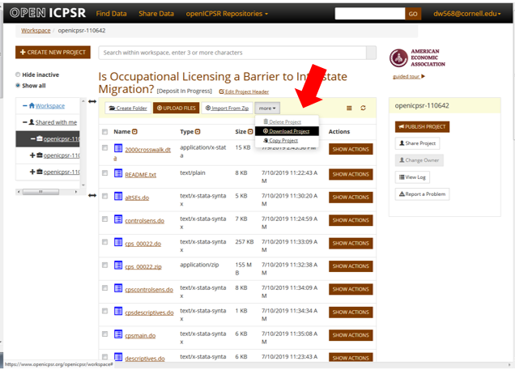

## Reminders

Normally, none of the actions below are technically possible, but you should nevertheless follow these guidelines:

- Do not publish the openICPSR projects.
- Do not upload files to the projects.
- Do not share projects with others unless instructed otherwise.
- Do not share screenshots with others

See [Privacy] section about expectations on privacy.


<!--chapter:end:94-01-how-to-use-openICPSR-backend.Rmd-->

## Accessing privately provided data

(to come)

<!--chapter:end:94-02-alternate-downloads.Rmd-->

## Accessing privately provided data

(to come)

<!--chapter:end:94-03-private-data.Rmd-->

# Access to Computers

You will be working on a variety of computers

- your laptop (Windows, OS X, Linux)
- a Windows remote desktop at [CISER](https://ciser.cornell.edu/computing/) ([Login instructions](https://ciser.cornell.edu/computing/computing-help/how-to-login/))
- possibly a [Linux cluster](https://biohpc.cornell.edu/lab/lab.aspx) or [Linux server](https://www2.vrdc.cornell.edu/news/ecco/step-1-requesting-an-ecco-account/ecco-account-creation/) (rare)
- [Bitbucket](https://bitbucket.org/account/signup/) 

## What can you do where

In principle, assuming you have the necessary software, you can work on any computer. Just remember to `git push` all changes back to Bitbucket.

## Where is the data

We are currently exploring how to make the data *mobile*. At present, we do not want the data in Bitbucket, so you will need to re-download the data on each computer you intend to **run programs**. So you should decide on one particular computer. You can edit documents and code anywhere else, but again, remember to `git push` any changes from your *other* computer, and to `git pull` on your *compute* computer.

## What software

By default, you should expect to run the code on CISER, which has a [broad selection of software](https://ciser.cornell.edu/computing/software/).

If you actually have the software on your laptop, you should feel free to run code there, but see the caveat below. We will not purchase software for your personal laptop, and we do not provide you with a computationally capable laptop.

Some software is not available on CISER. If you encounter the following, you should check with your supervisor:

| Software | Computing resource |
|----------|--------------------|
| Dynare   | Red Cloud Windows node |
| Fortran compiler | BioHPC linux cluster |
| C compiler  | BioHPC linux cluster |
| Eviews | Not currently available |

Much statistical software loads data into memory. Your laptop has a limited amount of memory (in 2018, between 2GB and 8GB, rarely more). CISER nodes and BioHPC nodes can have between 256GB and 1024 GB of memory!

## What if the code runs for a long time / I need to run to class / I need my life = Twitter back on my laptop

One of the advantages of running on the CISER or BioHPC nodes is that you can *disconnect* from the server, while leaving your programs running. That is one of the reasons to use them instead of your laptop. 

## Requesting Access

See setup checklist.


## Where can I learn more

- For CISER nodes, see [here](https://ciser.cornell.edu/computing/computing-help/how-to-login/)
- For special *Red Cloud* nodes, see [here](https://github.com/labordynamicsinstitute/replicability-training/wiki/Connect-to-a-Ciser-Custom-Red-Cloud-Machine)

<!--chapter:end:95_Access_to_computers.Rmd-->

# Using config.do in STATA

In "Verification" stage, we ask you to keep a log of what you do. Moreover, authors often use packages that are not default programs of STATA. We provide `template-config.do` in the template repository you clone which addresses these problems. 

## Why do we need log files?

- Log files record each step of the analysis and its results as a text. It also records error messages if you encounter any error upon running the code.
- There are other purposes to have log files, but for us, it is to communicate with other team members. 
    - When a replicator submits the report, a preapprover (and an approver) needs to verify how the code ran. It is to ensure that any discrepancies we find is not due to mistakes on our end.
    - Log file is crucial for this verification. Otherwise, preapprovers and approvers have to run the code again to verify which is not an ideal use of time, nor an efficient way to process the case.

## Why do we have to install programs?

- STATA, or any statistical software, does not provide all the package that enables or facilitates the analysis. Therefore, many user-written programs or extensions are publicly available for downloads. 
- We differ in installation process from many others in the sense that, we want to install programs in a specified directory that is NOT a system directory.
    - This is to ensure that the package is complete. A complete replication package should be stand-alone, regardless of packages installed in the machine that program is run.

## Explaining template-config.do

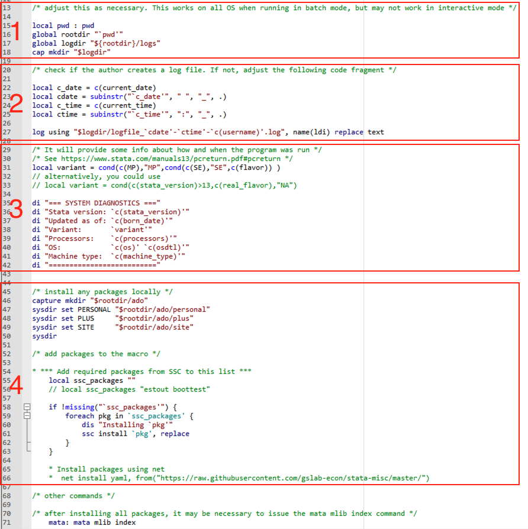

### Directory paths for log files.

`config.do` creates a subdirectory and saves log files in the subdirectory. Area 1 sets these directory paths. Let's say the current working directory path is the following, since jira issue number is AEAREP-9999 and openICPSR case number is 111111
    ```
    U:/Workspace/aearep-9999/111111
    ```

- line 16, ```global rootdir "`pwd"``` sets the current working directory as a root directory, a.k.a. rootdir.
- line 17, `global logdir "${rootdir}/logs"` sets the following direcotry as a directory for log files: U:/Workspace/aearep-9999/111111/logs 
- Notice that there is no such directory exists. Therefore, the do file creates one new directory in line 18.
    - `mkdir` is a command to create a directory 


### Opening a log file with current date and time

Since we usually run the program several times until we complete the replication, we would like to record all the instances. Therefore, we record the initial time we start running the code and use it in the name of the log file. Area 2 calls current date and time as local macro and open the log file.

- line 22-25: calls the current date and time as local macro
- line 27: start the log files

### System information

We require system information as part of the replication package. This is because some commands are sensitive to the OS, STATA version, machine type, etc. Area 3 calls in that information from the system and displays in the log file.

### Package installation

As explained above, we often need to install packages. Even when the packages were installed in other cases before, it should be irrelevant to your current case, since we install those packages within our deposit directory so that we can verify the completeness of the replication packages. Area 4 does this job.

- The sysdir commands (in line 47-50) redirects Stata to search for, and install ado files in the directories referenced. It won't automatically install them.
    - In case where the authors provided the ado files, adding a new command to the end of the config.do would suffice:
    ```
    adopath ++ "${rootdir}/packages"
    ```

- Add list of packages in the quotation maeks in **line 55**
    - line 56 provides an example.
    - line 58-62 installs each package if there are packages listed.

- In some cases, the installation would fail since you have to use "net install.." instead of "ssc install". In this case, uncomment and use line 66.


## How to use config.do

### Rename the config file.

The given name should be `template-config.do`. In order to use it, rename it to `config.do` and move it into the openICPSR folder (e.g. , 140XXX).

### Include config.do

- Add the following line at the beginning of each code file:
    ```
    include config.do
    ```
    and add the following at the end of each code file:
    ```
    log close _all
    ```
- If there is a master do file, you should put the above lines at the beginning and the end of the `master.do` once, and NOT include it in the individual code files.

- There will be cases where authors create their own log files. Do NOT comment out the log file creation here, as the named logfile will not conflict with any author-generated files. 

<!--chapter:end:96-01-using-config-stata.Rmd-->

# Running Code in Stata

Although, there are plenty of ways to run code in Stata, our goal with these instructions is to show the easiest way to do it, by minimizing both the manual steps replicators have to go through and the chance of making a mistake that prevents a successful run.

In essence, these instructions show how to deal with the three most common actions that replicators have to undertake when running Stata code:

 1. Making sure that paths (i.e., something like "Mycomputer/Documents/Workspace/) in the .do files (Stata scripts) reflect the appropriate location of code, data, and output in the computer where the code is run.
 2. Installing user-written functions, programs, or packages that are necessary to do computations and produce tables/figures.
 3. Creating .log files (files that record, in this case, Stata output) of the replication attempts.

## Step 1: check for a "master" .do file

> **[ACTION]** Check the README or the repository and determine if a master .do file was provided.

A master .do file is a Stata script that will call, in the correct sequence, all the programs necessary to construct analysis datasets, do all computations, and produce figures and tables. If a master do file exists, it should be mentioned in the README. In most cases, running a single master do file is sufficient to complete the reproduction. In general, a master script does not need to be a .do file. However, we will focus on cases where all work done in Stata is reduced to executing a single .do file.

If there is a master do file, continue with the following steps. If not, see the instruction below: *"When a master .do is not provided"*.

## Step 2: place config.do where the master .do file is located

> **[ACTION]** Copy the file `template-config.do` and paste it into the folder where the master file is located. Change the name from `template-config.do` to `config.do`

The folder with the code, whether is the root directory or a subfolder, should look something like this:

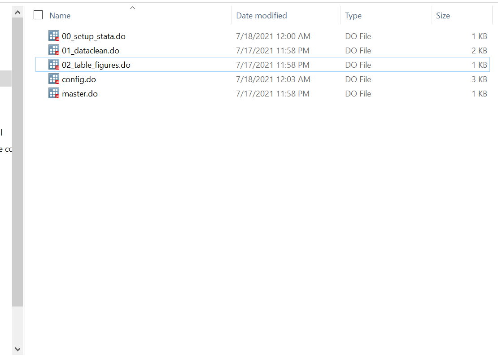

## Step 3: include config.do in the master .do file

> **[ACTION]** Open the master .do file. In the beginning, add the line:

```
1 include "config.do"
2
3 */ This is Master do file /*
```

> Save.

More information about `config.do` can be found in [Appendix F](https://labordynamicsinstitute.github.io/replicability-training-curriculum/using-config-do-in-stata.html) of the training materials.

In summary, `config.do` does 4 things:

- Creates a global variable called "rootdir" with the local path to the root directory.
- Creates a logs files.
- Sets a path to save the packages to be installed in the replication repository, and
- It allows you to install the packages simply by listing their names.

A crucial function of `config.do` is that it allows for the local installation of Stata packages, which is important for two reasons. First, it will enable us to check for the completeness of replication materials. Second, when running code in servers, we often do not have the necessary permissions to install Stata packages freely.`config.do` allow us to installed packages in the replication directory.  

## Step 4: modifying paths if necessary

> **[ACTION]**
>
> - Check the Readme and determine if (and where) the root directory should be modified.
> - Open the .do file to be modified (probably the master .do file) and set the global variable `$rootdir` as the path.
> - Save.

To run the code, we need to make sure that Stata can access the locally-saved data, access the packages that will be installed, and save the output in the computer where you are running the code. To do that, we often need to change some directory paths defined in the .do files provided. This step may vary in each replication package, so you need to look at the README instructions closely. Some packages may not require any change, while others may require a little more work.

However, the typical case will only require one modification, either to the master .do file or to a program called by the master .do file, where you define the path of the location of the replication package. This location is what we refer to as the "root directory". Once this change is made, the code provided (if it follows good practices) will define every other path relative to the root directory.

### Example

In a master file, a global variable "maindir" defines the path of the root directory as:

```
*/ This is Master do file /*

global maindir "C:\Users\Author\Dropbox\Project1" // this is the path to the repository
global data "$maindir/data" // path to data folder
global figures "$maindir/figures" // path to figures folder
```

You would add `config.do` and change the global.
After the change:

```
include "config.do"

*/ This is Master do file /*

global maindir "$rootdir" // this is the path to the repository
global data "$maindir/data" // path to data folder
global figures "$maindir/figures" // path to figures folder
```

## Step 5: Check the location of the master .do file and modify config.do

> **[ACTION]**
>
> - If the master .do file is directly placed in the root directory, set the parameter `scenario` to be `A` and save. (This is the default, so really no action is necessary.)
> - If the master .do file is inside a folder, open `config.do` and set the parameter `scenario` to `B` and save.
> - If the replication package includes a folder with Stata packages, add the line  `adopath ++` followed by the path of the location of that folder and save. See [Appendix F](https://labordynamicsinstitute.github.io/replicability-training-curriculum/using-config-do-in-stata.html) for details.
> - Add packages that need to be installed to config.do. See [Appendix F](https://labordynamicsinstitute.github.io/replicability-training-curriculum/using-config-do-in-stata.html) for details.

### Scenario A

A simplified directory structure that correspond with scenario "A" look like this:

```
directory/
               main.do
               scripts/
                   01_dosomething.do
                data/
                   data.dta
                   otherdata.dta
```

#### Example

- A Master .do file is in the main directory, and you have placed `config.do` in the main directory. The package `estout` and `ivreg2` need to be installed:

```
* Template config.do */

local scenario "A" 
* *** Add required packages from SSC to this list ***
local ssc_packages "estout ivreg2"
    // Example:
    // local ssc_packages "estout boottest"
    // If you need to "net install" packages, go to the very end of this program, and add them there.
```

### Scenario B

A simplified directory structure that correspond to scenario "B" looks like this:

```
 directory/
              code/
                 main.do
                 01_dosomething.do
              data/
                 data.dta
                 otherdata.dta

```

#### Example

- A Master .do file is  inside a folder and you have placed `config.do` in that same folder. The package `estout` needs to be installed:

```
* Template config.do */

local scenario "B"  // around line 30
*** Add required packages from SSC to this list ***
local ssc_packages "estout"
    // Example:
    // local ssc_packages "estout boottest"
    // If you need to "net install" packages, go to the very end of this program, and add them there.
```

<!--chapter:end:96-02-running-stata-code-on-windows.Rmd-->

# Using scan_packages.do

In "Writing Preliminary Report" stage, we ask you to check the completeness of the information on system requirements. Often, authors do not list out packages they installed that are not default packages in STATA. The authors should list them in the README (even when they provide ado files!), but it does not always happen. To help you identify these packages, we provide an useful tool for this exercise.

- Locate a directory named "tools/Stata_scan_code/".
- Change the following command in line 11 with your system information:
    ```
    global codedir "U:/Workspace/aearep-2216/140161"
    ``` 
    You should locate the directory where the codes are. This will be the directory where the output excel file will be saved.
- Execute the dofile.
- Locate the file "candidatepackages.xlsx", use the information there, and remember to push the file to the repository.

<!--chapter:end:96-03-stata-scan-packages.Rmd-->

# Authentication-related issues

For CISER-related authentication or logon questions, see [CCSS-RS pages](https://socialsciences.cornell.edu/research-support/login-instructions#passwords).


<!--chapter:end:97-00-authentication.Rmd-->

## Bitbucket Authentication

Any user who created a Bitbucket account after Semptember 13, 2021 may encounter the following error when attempting to git clone (or push) using Internet Explorer.
  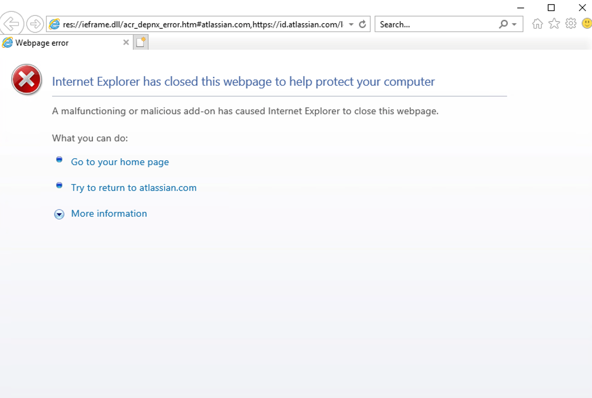

### Temporary Solution

1. Make Firefox (or Edge) your default browswer. 
2. Sign into Bitbucket on your browswer and then attempt the git action once again. You may then receive an error like below:

  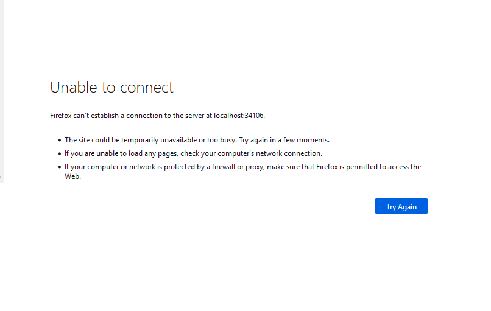
  
3. Attempt the git action again.

### Long-Term Solution

The long-term solution is to create an [App Password](https://support.atlassian.com/bitbucket-cloud/docs/app-passwords/).

1. Follow the steps to create an App Password. 

Some important points about app passwords:

- You **cannot** view an app password or adjust permissions after you create the app password.
- You **cannot** use them to log in to your Bitbucket account at bitbucket.org.
- You **cannot** use app passwords to manage workspace actions.

<!--chapter:end:97-01-Bitbucket-authentication.Rmd-->

# References


<!--chapter:end:99-References.Rmd-->

